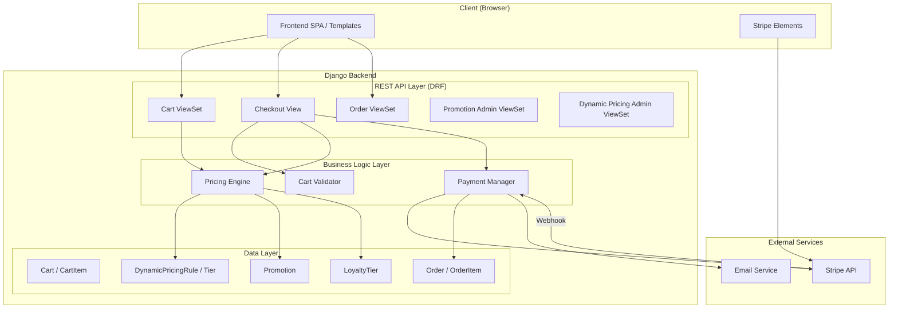

# Design Document: Cart, Payment & Promotions

## Overview

This design covers the Cart, Payment & Promotions system for the VIPET luxury pet hotel platform. The system introduces three new Django apps (`cart`, `orders`, `promotions`) that integrate with existing apps (`services`, `pets`, `reservations`, `accounts`) to provide:

1. **Shopping Cart** — Server-side cart persisted per authenticated client, supporting multiple services with pets, dates, and quantities.
2. **Payment Processing** — Stripe integration for secure credit card payments via Payment Intents, with webhook-based order confirmation.
3. **Dynamic Pricing** — Volume-based per-day rate discounts for boarding services.
4. **Promotions & Loyalty** — Admin-managed promotional offers and automatic loyalty discounts based on booking history.
5. **Pricing Engine** — A deterministic calculation pipeline applying discounts in a defined order (dynamic → loyalty → promotional) with rounding and clamping guarantees.

The system exposes a REST API (DRF ViewSets under `/api/v1/`) consumed by the frontend, with Stripe Elements handling card tokenization client-side.

## Architecture



### Design Decisions

1. **Three new apps** (`cart`, `orders`, `promotions`) — separation of concerns, each app owns its domain models and API.
2. **Pricing Engine as a service module** — lives in `apps/cart/pricing.py` as pure functions, making it testable without database dependencies. It receives data and produces computed results.
3. **Stripe Payment Intents flow** — server creates the PaymentIntent, client confirms with Stripe Elements, webhook finalizes the order. This ensures PCI compliance (no card data touches our server).
4. **Idempotency** — Each checkout attempt generates a unique idempotency key. Webhook processing uses `select_for_update` with PaymentIntent ID to prevent duplicate orders.
5. **One Cart per Client** — Enforced via unique constraint on `client` FK. Cart is server-side and survives sessions.

## Components and Interfaces

### App: `apps/cart`

| Component | Responsibility |
|-----------|---------------|
| `models.py` | `Cart`, `CartItem` models |
| `serializers.py` | Cart/CartItem serialization with computed pricing fields |
| `api_views.py` | `CartViewSet` (CRUD items), `CheckoutView` (initiate payment) |
| `pricing.py` | `PricingEngine` — pure functions for price calculation |
| `validators.py` | `CartValidator` — checkout validation logic |

**Key Interfaces:**

```python
# pricing.py
class PricingEngine:
    @staticmethod
    def calculate_item_price(
        service: Service,
        quantity: int,
        num_days: int | None,
        loyalty_tier: LoyaltyTier | None,
        best_promotion: Promotion | None,
        dynamic_pricing_rules: list[DynamicPricingTier],
    ) -> PriceBreakdown:
        """Calculate final price for a single cart item with full breakdown."""
        ...

    @staticmethod
    def calculate_cart_total(items: list[PriceBreakdown]) -> CartTotal:
        """Sum all item breakdowns into cart totals."""
        ...
```

```python
# validators.py
class CartValidator:
    def validate_for_checkout(self, cart: Cart) -> list[ValidationError]:
        """Run all validation rules on cart. Returns list of errors (empty = valid)."""
        ...
```

### App: `apps/orders`

| Component | Responsibility |
|-----------|---------------|
| `models.py` | `Order`, `OrderItem` models |
| `serializers.py` | Order/OrderItem read-only serialization |
| `api_views.py` | `OrderViewSet` (list/retrieve for client) |
| `payment.py` | `PaymentManager` — Stripe interaction, order creation, webhook handling |
| `webhooks.py` | Stripe webhook endpoint |
| `emails.py` | Order confirmation email logic |

**Key Interfaces:**

```python
# payment.py
class PaymentManager:
    def create_payment_intent(self, cart: Cart, idempotency_key: str) -> stripe.PaymentIntent:
        """Create Stripe PaymentIntent with cart total in centimes."""
        ...

    def handle_payment_success(self, payment_intent_id: str) -> Order:
        """Create Order from successful payment. Idempotent — checks for existing order."""
        ...
```

### App: `apps/promotions`

| Component | Responsibility |
|-----------|---------------|
| `models.py` | `Promotion`, `DynamicPricingRule`, `DynamicPricingTier`, `LoyaltyTier` models |
| `serializers.py` | Promotion CRUD serialization, DynamicPricing/Loyalty config serialization |
| `api_views.py` | `PromotionViewSet` (admin CRUD), `DynamicPricingViewSet`, `LoyaltyTierViewSet` |

### API Endpoints

| Method | Endpoint | Auth | Description |
|--------|----------|------|-------------|
| GET | `/api/v1/cart/` | Client | Get client's cart with all items and pricing |
| POST | `/api/v1/cart/items/` | Client | Add item to cart |
| PATCH | `/api/v1/cart/items/{id}/` | Client | Update item quantity |
| DELETE | `/api/v1/cart/items/{id}/` | Client | Remove item from cart |
| DELETE | `/api/v1/cart/` | Client | Clear entire cart |
| POST | `/api/v1/cart/checkout/` | Client | Validate cart and create PaymentIntent |
| POST | `/api/v1/orders/webhook/stripe/` | None (signature verified) | Stripe webhook |
| GET | `/api/v1/orders/` | Client | List client's orders (paginated) |
| GET | `/api/v1/orders/{id}/` | Client | Order detail with items |
| GET | `/api/v1/promotions/` | Admin | List promotions (paginated, filterable) |
| POST | `/api/v1/promotions/` | Admin | Create promotion |
| PATCH | `/api/v1/promotions/{id}/` | Admin | Update promotion |
| DELETE | `/api/v1/promotions/{id}/` | Admin | Delete promotion (if unused) |
| GET/PUT | `/api/v1/promotions/dynamic-pricing/` | Admin | Get/Update dynamic pricing config |
| GET/PUT | `/api/v1/promotions/loyalty-tiers/` | Admin | Get/Update loyalty tier config |

## Data Models

### Cart App Models

```python
class Cart(models.Model):
    id = models.BigAutoField(primary_key=True)
    client = models.OneToOneField(
        settings.AUTH_USER_MODEL,
        on_delete=models.CASCADE,
        related_name="cart",
        limit_choices_to={"role": "client"},
    )
    created_at = models.DateTimeField(auto_now_add=True)
    updated_at = models.DateTimeField(auto_now=True)

    class Meta:
        verbose_name = "Cart"


class CartItem(models.Model):
    id = models.BigAutoField(primary_key=True)
    cart = models.ForeignKey(Cart, on_delete=models.CASCADE, related_name="items")
    service = models.ForeignKey("services.Service", on_delete=models.CASCADE)
    pet = models.ForeignKey("pets.Pet", on_delete=models.CASCADE)
    start_date = models.DateField(null=True, blank=True)
    end_date = models.DateField(null=True, blank=True)
    quantity = models.PositiveIntegerField(default=1)  # 1-50
    created_at = models.DateTimeField(auto_now_add=True)
    updated_at = models.DateTimeField(auto_now=True)

    class Meta:
        constraints = [
            models.UniqueConstraint(
                fields=["cart", "service", "pet", "start_date", "end_date"],
                name="unique_cart_item",
            ),
        ]
        indexes = [
            models.Index(fields=["cart", "-created_at"], name="cartitem_cart_created_idx"),
        ]
```

### Orders App Models

```python
class Order(models.Model):
    STATUS_CHOICES = [
        ("paid", "Paid"),
        ("refunded", "Refunded"),
        ("failed", "Failed"),
    ]

    id = models.BigAutoField(primary_key=True)
    order_number = models.CharField(max_length=20, unique=True, db_index=True)
    client = models.ForeignKey(
        settings.AUTH_USER_MODEL,
        on_delete=models.CASCADE,
        related_name="orders",
    )
    subtotal = models.DecimalField(max_digits=10, decimal_places=2)
    total_discount = models.DecimalField(max_digits=10, decimal_places=2, default=0)
    total_paid = models.DecimalField(max_digits=10, decimal_places=2)
    stripe_payment_intent_id = models.CharField(max_length=255, unique=True, db_index=True)
    status = models.CharField(max_length=10, choices=STATUS_CHOICES, default="paid")
    created_at = models.DateTimeField(auto_now_add=True)

    class Meta:
        ordering = ["-created_at"]
        indexes = [
            models.Index(fields=["client", "-created_at"], name="order_client_created_idx"),
        ]


class OrderItem(models.Model):
    id = models.BigAutoField(primary_key=True)
    order = models.ForeignKey(Order, on_delete=models.CASCADE, related_name="items")
    service_name = models.CharField(max_length=100)
    service_category = models.CharField(max_length=30)
    pet_name = models.CharField(max_length=100)
    start_date = models.DateField(null=True, blank=True)
    end_date = models.DateField(null=True, blank=True)
    quantity = models.PositiveIntegerField(default=1)
    unit_price = models.DecimalField(max_digits=8, decimal_places=2)
    num_days = models.PositiveIntegerField(null=True, blank=True)
    dynamic_discount_amount = models.DecimalField(max_digits=8, decimal_places=2, default=0)
    loyalty_discount_percentage = models.DecimalField(max_digits=5, decimal_places=2, default=0)
    loyalty_discount_amount = models.DecimalField(max_digits=8, decimal_places=2, default=0)
    promotion_name = models.CharField(max_length=100, blank=True)
    promotion_discount_amount = models.DecimalField(max_digits=8, decimal_places=2, default=0)
    final_price = models.DecimalField(max_digits=10, decimal_places=2)

    class Meta:
        indexes = [
            models.Index(fields=["order"], name="orderitem_order_idx"),
        ]
```

### Promotions App Models

```python
class Promotion(models.Model):
    DISCOUNT_TYPE_CHOICES = [
        ("percentage", "Percentage"),
        ("fixed", "Fixed Amount"),
    ]

    id = models.BigAutoField(primary_key=True)
    name = models.CharField(max_length=100)
    description = models.TextField(max_length=500, blank=True)
    discount_type = models.CharField(max_length=10, choices=DISCOUNT_TYPE_CHOICES)
    discount_value = models.DecimalField(max_digits=8, decimal_places=2)
    start_date = models.DateField()
    end_date = models.DateField()
    is_active = models.BooleanField(default=True, db_index=True)
    target_services = models.ManyToManyField(
        "services.Service", blank=True, related_name="promotions"
    )
    target_categories = models.JSONField(default=list, blank=True)  # list of category strings
    created_at = models.DateTimeField(auto_now_add=True)
    updated_at = models.DateTimeField(auto_now=True)

    class Meta:
        ordering = ["-start_date"]
        indexes = [
            models.Index(fields=["is_active", "-start_date"], name="promo_active_start_idx"),
        ]


class DynamicPricingRule(models.Model):
    """Singleton-like config: one active set of tiers for boarding services."""
    id = models.BigAutoField(primary_key=True)
    name = models.CharField(max_length=100, default="Boarding Volume Discount")
    is_active = models.BooleanField(default=True)
    created_at = models.DateTimeField(auto_now_add=True)
    updated_at = models.DateTimeField(auto_now=True)


class DynamicPricingTier(models.Model):
    id = models.BigAutoField(primary_key=True)
    rule = models.ForeignKey(DynamicPricingRule, on_delete=models.CASCADE, related_name="tiers")
    min_days = models.PositiveIntegerField()
    max_days = models.PositiveIntegerField()
    discount_percentage = models.DecimalField(max_digits=5, decimal_places=2)  # 0-50

    class Meta:
        ordering = ["min_days"]
        constraints = [
            models.CheckConstraint(
                check=models.Q(discount_percentage__gte=0, discount_percentage__lte=50),
                name="dp_tier_discount_range",
            ),
            models.CheckConstraint(
                check=models.Q(min_days__lte=models.F("max_days")),
                name="dp_tier_min_lte_max",
            ),
        ]


class LoyaltyTier(models.Model):
    id = models.BigAutoField(primary_key=True)
    name = models.CharField(max_length=50)  # e.g. "Bronze", "Silver", "Gold"
    min_bookings = models.PositiveIntegerField()
    discount_percentage = models.DecimalField(max_digits=5, decimal_places=2)  # 1-50

    class Meta:
        ordering = ["min_bookings"]
        constraints = [
            models.CheckConstraint(
                check=models.Q(discount_percentage__gte=1, discount_percentage__lte=50),
                name="loyalty_discount_range",
            ),
        ]
```

### Data Types (Value Objects)

```python
from dataclasses import dataclass
from decimal import Decimal

@dataclass(frozen=True)
class PriceBreakdown:
    """Computed price breakdown for a single cart item."""
    base_price: Decimal          # service.price * quantity (or per-day * days * qty)
    dynamic_discount: Decimal    # amount saved from dynamic pricing
    price_after_dynamic: Decimal # base_price - dynamic_discount
    loyalty_percentage: Decimal  # loyalty tier % applied
    loyalty_discount: Decimal    # amount saved from loyalty
    price_after_loyalty: Decimal # price_after_dynamic - loyalty_discount
    promotion_label: str         # name of applied promotion (or "")
    promotion_discount: Decimal  # amount saved from promotion
    final_price: Decimal         # final clamped price (>= 0)

@dataclass(frozen=True)
class CartTotal:
    """Aggregated cart totals."""
    subtotal: Decimal       # sum of base prices
    total_discount: Decimal # sum of all discounts
    total_to_pay: Decimal   # sum of final prices
```

## Correctness Properties

*A property is a characteristic or behavior that should hold true across all valid executions of a system — essentially, a formal statement about what the system should do. Properties serve as the bridge between human-readable specifications and machine-verifiable correctness guarantees.*

### Property 1: Cart item deduplication

*For any* cart and any (service, pet, start_date, end_date) combination, adding that combination N times to the cart SHALL result in exactly one CartItem with quantity equal to N (starting from 1 on first add, incrementing on subsequent adds), never creating duplicate items for the same combination.

**Validates: Requirements 1.1, 1.2**

### Property 2: Quantity validation range

*For any* integer value V, updating a CartItem's quantity SHALL succeed if and only if 1 ≤ V ≤ 50. For values outside this range, the update SHALL be rejected and the CartItem quantity SHALL remain unchanged.

**Validates: Requirements 1.5, 1.6**

### Property 3: Cart total excludes unavailable services

*For any* cart containing a mix of CartItems where some reference services with is_available=False, the computed cart total SHALL equal the sum of final prices of only those CartItems whose referenced service has is_available=True.

**Validates: Requirements 1.7**

### Property 4: Dynamic pricing formula correctness

*For any* boarding service with base_rate R per day, and any number of days D in [1, 365], the Pricing Engine SHALL compute the boarding total as R × D × (1 − tier_discount_percentage(D)), where tier_discount_percentage is determined by the single applicable tier for the total number of days D. The default tiers are: 1-3 days → 0%, 4-7 days → 10%, 8-14 days → 15%, 15-365 days → 20%.

**Validates: Requirements 4.1, 4.2, 4.3**

### Property 5: Dynamic pricing tier contiguity validation

*For any* set of dynamic pricing tier definitions, the system SHALL accept the configuration if and only if: (a) tiers cover all days from 1 to 365 without gaps, (b) no two tiers overlap in their day ranges, and (c) each tier's discount_percentage is in [0, 50]. Any configuration violating these constraints SHALL be rejected.

**Validates: Requirements 4.5, 4.6**

### Property 6: Loyalty tier selection

*For any* client with C completed reservations in a given service category, the Pricing Engine SHALL select the loyalty discount tier whose min_bookings threshold is the highest value ≤ C. If C is below all tier thresholds, no loyalty discount SHALL be applied (0%). Default tiers: 5-9 → 5%, 10-19 → 8%, 20+ → 12%.

**Validates: Requirements 6.1, 6.2, 6.3, 6.7**

### Property 7: Discount application order

*For any* CartItem with base_price B, dynamic pricing discount D, loyalty discount percentage L%, and promotional discount P, the Pricing Engine SHALL compute the final price as:
1. price_after_dynamic = B − D (rounded to 2 decimal places, half-up)
2. loyalty_amount = price_after_dynamic × L% (rounded to 2 decimal places, half-up)
3. price_after_loyalty = price_after_dynamic − loyalty_amount
4. price_after_promo = price_after_loyalty − P (rounded to 2 decimal places, half-up)
5. final_price = max(0.00, price_after_promo)

**Validates: Requirements 7.1, 6.4**

### Property 8: Non-negative price clamping

*For any* CartItem, regardless of the combination of discounts applied (dynamic + loyalty + promotional), the final price SHALL never be less than 0.00 MAD. If the sum of discounts would produce a negative result, the final price SHALL be clamped to 0.00 MAD.

**Validates: Requirements 7.2**

### Property 9: Cart total consistency

*For any* cart with N items, the displayed cart total SHALL satisfy: |sum(item_i.final_price for i in 1..N) − cart_total| ≤ 0.01 MAD. The sum of individually computed item final prices SHALL equal the cart total with no rounding discrepancy exceeding one centime.

**Validates: Requirements 7.4**

### Property 10: Best promotion selection

*For any* CartItem eligible for multiple active promotions, the Pricing Engine SHALL apply exactly one promotion — the one that yields the highest discount amount in MAD for that item. The discount amount for a percentage promotion is min(value% × base_price, 50% × base_price). The discount amount for a fixed promotion is min(fixed_amount, item_price).

**Validates: Requirements 5.6, 5.8, 5.9**

### Property 11: Promotion eligibility

*For any* promotion with fields (is_active, start_date, end_date) and a reference date "today", the promotion SHALL be considered eligible for application if and only if: is_active=True AND start_date ≤ today AND end_date ≥ today.

**Validates: Requirements 5.3**

### Property 12: Promotion targeting

*For any* active promotion P and any CartItem I, the promotion P SHALL apply to item I if and only if: (a) P targets a specific service AND I.service is in P.target_services, OR (b) P targets a category AND I.service.category is in P.target_categories.

**Validates: Requirements 5.4, 5.5**

### Property 13: Cart validation completeness

*For any* cart submitted for checkout containing items with various validation violations (unavailable services, pets not owned by client, invalid dates, out-of-range item counts), the validator SHALL return exactly the complete set of violations — one error per violated rule per item — without short-circuiting, and the cart contents SHALL remain unchanged after failed validation.

**Validates: Requirements 2.1, 2.2, 2.3, 2.4, 2.5, 2.7**

### Property 14: Date range validation

*For any* CartItem with date fields (start_date, end_date), the checkout validator SHALL accept the item if and only if: start_date ≥ today (UTC) AND end_date > start_date AND (end_date − start_date).days ≤ 365. Items without date fields SHALL pass date validation unconditionally.

**Validates: Requirements 2.4**

### Property 15: Webhook idempotency

*For any* Stripe payment_intent_id, processing the "payment_intent.succeeded" webhook event N times (N ≥ 1) SHALL result in exactly one Order record with that payment_intent_id. Subsequent processing of the same event SHALL be a no-op.

**Validates: Requirements 3.6**

### Property 16: Order preserves cart item data

*For any* successfully paid cart, the resulting Order SHALL contain one OrderItem for each CartItem, preserving service name, pet name, dates, quantity, unit price, and all applied discount amounts at the time of payment. Additionally, for each OrderItem with a date range, exactly one Reservation with status "pending" SHALL be created.

**Validates: Requirements 3.3, 3.7**

### Property 17: Promotion validation

*For any* promotion creation/update request with fields (name, start_date, end_date, discount_type, discount_value), the system SHALL accept the request if and only if: name is non-empty, start_date < end_date, start_date ≥ today (for creation), discount_value ∈ [1, 50] for percentage type, and discount_value ∈ [1.00, 10000.00] for fixed type. Invalid requests SHALL be rejected with field-specific error messages.

**Validates: Requirements 5.2, 5.10, 9.3**

### Property 18: Promotion deletion guard

*For any* promotion P, deletion SHALL succeed if and only if no OrderItem references P (via promotion_applied field). If at least one OrderItem references P, deletion SHALL be rejected and P SHALL remain unchanged.

**Validates: Requirements 9.4, 9.5**

### Property 19: Order ownership isolation

*For any* two clients A and B, when client A queries their order history, the response SHALL contain only orders where order.client = A and SHALL never include orders belonging to client B.

**Validates: Requirements 8.2**

### Property 20: MAD to centimes conversion

*For any* valid cart total T in MAD (where 1.00 ≤ T ≤ 999,999.99), the PaymentIntent amount SHALL equal round(T × 100) centimes, and the resulting centimes value SHALL be in [100, 99_999_999].

**Validates: Requirements 3.1**

## Error Handling

### Payment Errors

| Error Scenario | Behavior |
|----------------|----------|
| Stripe payment declined | Return Stripe decline reason to client, preserve cart, allow up to 3 retries per checkout session |
| Network timeout (30s) | Return connectivity error message, preserve cart, allow retry |
| Invalid Stripe secret key | Return "payment processing temporarily unavailable", log error, never expose key details |
| Webhook signature invalid | Return HTTP 400, log timestamp + source IP + failure reason |
| Duplicate PaymentIntent processing | No-op (idempotent), return existing order |

### Cart Errors

| Error Scenario | Behavior |
|----------------|----------|
| Add item to full cart (30 items) | Return 400 with error message indicating max limit |
| Quantity outside [1, 50] | Return 400 with allowed range message |
| Service becomes unavailable | Flag item, exclude from total, indicate in response |
| Pet deleted (CASCADE) | CartItem auto-removed by Django CASCADE |
| Checkout with invalid items | Return all validation errors (collected, not short-circuited), preserve cart |

### Promotion Errors

| Error Scenario | Behavior |
|----------------|----------|
| Invalid promotion fields | Return 400 with per-field error messages |
| Overlapping/gapped tiers | Return 400 with invalid tier boundaries message |
| Delete used promotion | Return 400 with "linked to existing orders" message, suggest deactivation |
| Loyalty tier config invalid (non-ascending) | Return 400 with specific validation error |

### General Error Patterns

- All API errors return structured JSON: `{"errors": [{"field": "...", "message": "..."}]}` or `{"detail": "..."}` for non-field errors.
- 400 Bad Request for validation failures.
- 402 Payment Required for payment failures (with Stripe decline reason).
- 403 Forbidden for permission violations.
- 404 Not Found for missing resources.
- 409 Conflict for idempotency conflicts.
- 500 Internal Server Error is never returned intentionally — unexpected errors are logged and a generic message is returned.

## Testing Strategy

### Testing Framework

- **Unit/Integration tests**: `pytest` + `pytest-django` (already configured in project)
- **Property-based tests**: `hypothesis` (already in requirements.txt, already used in `apps/core/tests/`)
- **Mocking**: `unittest.mock` for Stripe API interactions
- **Database**: SQLite for tests (fast, isolated)

### Property-Based Testing Configuration

- Library: **Hypothesis** (version ≥ 6.115.3, already installed)
- Minimum iterations: **100 examples per property** (`@settings(max_examples=100)`)
- Each property test references its design property via docstring tag:
  ```python
  """Feature: cart-payment-promos, Property {N}: {property_text}"""
  ```

### Test Categories

**Property-Based Tests (Pricing Engine — pure functions):**
- Properties 4, 5, 6, 7, 8, 9, 10, 11, 12 — All test pure pricing/discount logic
- Properties 1, 2, 3, 13, 14 — Cart logic (with lightweight Django test setup)
- Properties 17, 20 — Validation and conversion logic

**Example-Based Unit Tests:**
- Cart CRUD operations (add, remove, update)
- Order creation flow (mocked Stripe)
- Promotion CRUD by admin
- Email sending on order creation (mocked email backend)
- Stripe Elements integration validation
- Admin dashboard filtering

**Integration Tests:**
- Full checkout flow (cart → payment → order → reservation)
- Webhook processing end-to-end
- Cart persistence across requests
- Concurrent checkout attempts (race condition testing)

**Smoke Tests:**
- Stripe key configuration present
- No card data fields in models/serializers
- API endpoint authentication enforcement

### Test File Organization

```
apps/cart/tests/
    __init__.py
    test_pricing_engine_property.py     # Properties 4-12
    test_cart_logic_property.py         # Properties 1-3, 13-14
    test_cart_api.py                    # Example-based API tests
    test_validators.py                  # Validation logic tests
    test_checkout.py                    # Checkout flow integration

apps/orders/tests/
    __init__.py
    test_payment_property.py            # Properties 15, 16, 20
    test_webhook.py                     # Webhook handling tests
    test_order_api.py                   # Order list/detail tests
    test_order_isolation_property.py    # Property 19

apps/promotions/tests/
    __init__.py
    test_promotion_validation_property.py  # Properties 17, 18
    test_promotion_api.py                  # Admin CRUD tests
    test_dynamic_pricing_property.py       # Property 5
    test_loyalty_api.py                    # Loyalty config tests
```

