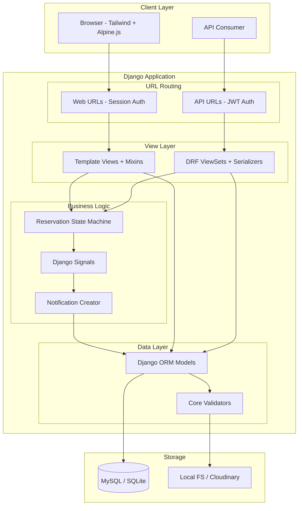

# Design Document: VIPET Full Platform

## Overview

This design covers the remaining modules of the VIPET luxury pet hotel platform: Pet management, Reservations with status workflow, Notifications, Gallery, Contact, Dashboard (admin and client), Service views/API, Public pages, Error handling, and API serialization patterns.

The platform is built on Django 5.x with Django REST Framework (DRF), SimpleJWT for API authentication, session auth for web views, Tailwind CSS + Alpine.js frontend, and uses MySQL in production / SQLite in development. The existing codebase provides: CustomUser model (email-based auth with client/admin roles), Service model (7 categories, pricing in MAD), accounts app (register, login, logout, password reset, profile), image validation via libmagic, JWT endpoints, role-based access mixins, and error handler views.

### Key Design Decisions

1. **Hybrid API + Template approach**: Web views use Django templates with session auth; API endpoints use DRF with JWT auth. Both share the same models and business logic layer.
2. **Reservation state machine**: Status transitions are enforced at the model/service layer, not in views, ensuring consistency across web and API interfaces.
3. **Signal-driven notifications**: Reservation status changes trigger notifications via Django signals, decoupling notification creation from reservation logic.
4. **Ownership enforcement via querysets**: Rather than checking ownership in every view method, we filter querysets at the view level so clients only ever see their own data.
5. **Shared validators**: Image validation via `apps.core.validators.validate_image_file` is reused across Pet, Gallery, and Profile uploads.

## Architecture



### Request Flow

1. **Web request**: Browser → Django middleware (session) → URL dispatcher → View (with role mixin) → Model/Service → Template response
2. **API request**: Client → Django middleware → URL dispatcher → DRF View (JWT permission) → Serializer → Model/Service → JSON response
3. **Notification flow**: Reservation status change → `post_save` signal → `create_notification()` → Notification record in DB

## Components and Interfaces

### 1. Pets App (`apps/pets/`)

| Component | Responsibility |
|-----------|---------------|
| `Pet` model | Store pet data with owner FK |
| `PetSerializer` | DRF serialization for API |
| `PetForm` | Django form for web CRUD |
| `PetListView` / `PetCreateView` / `PetUpdateView` / `PetDeleteView` | Web views (client-only) |
| `PetViewSet` | DRF API viewset |

**Interfaces:**
- `GET /client/pets/` → List client's pets (web)
- `POST /client/pets/create/` → Create pet (web)
- `GET/PUT /client/pets/<id>/edit/` → Update pet (web)
- `POST /client/pets/<id>/delete/` → Delete pet (web)
- `GET/POST /api/v1/pets/` → List/Create (API)
- `GET/PUT/DELETE /api/v1/pets/<id>/` → Retrieve/Update/Delete (API)

### 2. Reservations App (`apps/reservations/`)

| Component | Responsibility |
|-----------|---------------|
| `Reservation` model | Store booking data with status workflow |
| `ReservationSerializer` | DRF serialization |
| `ReservationForm` | Django form for creation |
| `ReservationStateMachine` | Enforce valid status transitions |
| `ReservationListView` / `ReservationCreateView` | Web views |
| `ReservationViewSet` | DRF API viewset |

**Status Transitions:**
```
Pending → Approved (admin only)
Pending → Rejected (admin only)
Pending → Cancelled (owning client only)
Approved → Completed (admin only)
```

**Interfaces:**
- `GET /client/reservations/` → Client's reservations (web)
- `POST /client/reservations/create/` → Create reservation (web)
- `POST /client/reservations/<id>/cancel/` → Cancel (web, client)
- `GET /admin-panel/reservations/` → All reservations (web, admin)
- `POST /admin-panel/reservations/<id>/approve/` → Approve (web, admin)
- `POST /admin-panel/reservations/<id>/reject/` → Reject (web, admin)
- `POST /admin-panel/reservations/<id>/complete/` → Complete (web, admin)
- `GET/POST /api/v1/reservations/` → List/Create (API)
- `GET /api/v1/reservations/<id>/` → Detail (API)
- `POST /api/v1/reservations/<id>/cancel/` → Cancel (API)
- `POST /api/v1/reservations/<id>/approve/` → Approve (API, admin)
- `POST /api/v1/reservations/<id>/reject/` → Reject (API, admin)
- `POST /api/v1/reservations/<id>/complete/` → Complete (API, admin)

### 3. Notifications App (`apps/notifications/`)

| Component | Responsibility |
|-----------|---------------|
| `Notification` model | Store notification records |
| `NotificationSerializer` | DRF serialization |
| `NotificationViewSet` | API-only (list, mark-read, unread-count) |
| `signals.py` | Listen to reservation status changes |

**Interfaces:**
- `GET /api/v1/notifications/` → List notifications (paginated)
- `PATCH /api/v1/notifications/<id>/read/` → Mark as read
- `GET /api/v1/notifications/unread-count/` → Unread count

### 4. Gallery App (`apps/gallery/`)

| Component | Responsibility |
|-----------|---------------|
| `GalleryImage` model | Store image metadata + file reference |
| `GalleryImageSerializer` | DRF serialization |
| `GalleryPublicView` | Public gallery page (template) |
| `GalleryAdminUploadView` / `GalleryAdminDeleteView` | Admin management (web) |

**Interfaces:**
- `GET /gallery/` → Public gallery page
- `POST /admin-panel/gallery/upload/` → Upload image (admin)
- `POST /admin-panel/gallery/<id>/delete/` → Delete image (admin)

### 5. Contact App (`apps/contact/`)

| Component | Responsibility |
|-----------|---------------|
| `ContactMessage` model | Store contact submissions |
| `ContactForm` | Django form with validation |
| `ContactPageView` | Public contact form page |
| `ContactAdminListView` / `ContactAdminDetailView` | Admin inbox (web) |

**Interfaces:**
- `GET /contact/` → Contact form page
- `POST /contact/` → Submit contact message
- `GET /admin-panel/contact/` → Admin inbox
- `GET /admin-panel/contact/<id>/` → View message (marks as read)

### 6. Dashboard App (`apps/dashboard/`)

| Component | Responsibility |
|-----------|---------------|
| `AdminDashboardView` | KPI display + management sections |
| `ClientDashboardView` | Pet count + recent reservations |
| `dashboard_urls.py` | Separate URL configs for admin/client namespaces |

**Interfaces:**
- `GET /client/` → Client dashboard
- `GET /admin-panel/` → Admin dashboard

### 7. Services App (`apps/services/`)

| Component | Responsibility |
|-----------|---------------|
| `ServiceListView` | Public services page (template) |
| `ServiceSerializer` | DRF serialization |
| `ServiceViewSet` | API endpoint with filtering |
| `ServiceAdminCreateView` / `ServiceAdminUpdateView` / `ServiceAdminDeleteView` | Admin CRUD (web) |

**Interfaces:**
- `GET /services/` → Public listing with category filter
- `GET /api/v1/services/` → API listing with filters
- `POST /admin-panel/services/create/` → Create service (admin)
- `POST /admin-panel/services/<id>/edit/` → Update service (admin)
- `POST /admin-panel/services/<id>/delete/` → Delete service (admin)

### 8. Core App (`apps/core/`)

| Component | Responsibility |
|-----------|---------------|
| `HomePageView` | Public home page with featured services |
| `AboutPageView` | Public about page |
| Error handlers | 403, 404, 500 custom pages (already implemented) |
| `validate_image_file` | Image upload validation (already implemented) |
| Access mixins | `ClientRequiredMixin`, `AdminRequiredMixin` (already implemented) |

## Data Models

### Pet Model (`apps/pets/models.py`)

```python
class Pet(models.Model):
    SPECIES_CHOICES = [
        ("dog", "Dog"),
        ("cat", "Cat"),
        ("bird", "Bird"),
        ("rabbit", "Rabbit"),
        ("other", "Other"),
    ]
    GENDER_CHOICES = [
        ("male", "Male"),
        ("female", "Female"),
        ("unknown", "Unknown"),
    ]
    VACCINATION_CHOICES = [
        ("up_to_date", "Up to Date"),
        ("overdue", "Overdue"),
        ("unknown", "Unknown"),
    ]

    id                = models.BigAutoField(primary_key=True)
    owner             = models.ForeignKey(settings.AUTH_USER_MODEL, on_delete=models.CASCADE, related_name="pets")
    name              = models.CharField(max_length=100)
    species           = models.CharField(max_length=20, choices=SPECIES_CHOICES)
    breed             = models.CharField(max_length=100, blank=True)
    gender            = models.CharField(max_length=10, choices=GENDER_CHOICES)
    date_of_birth     = models.DateField()
    weight            = models.DecimalField(max_digits=5, decimal_places=2)  # 0.01–999.99 kg
    medical_notes     = models.TextField(blank=True)
    vaccination_status = models.CharField(max_length=20, choices=VACCINATION_CHOICES, default="unknown")
    photo             = models.ImageField(upload_to="pets/", null=True, blank=True)
    created_at        = models.DateTimeField(auto_now_add=True)
    updated_at        = models.DateTimeField(auto_now=True)

    class Meta:
        ordering = ["-created_at"]
        indexes = [
            models.Index(fields=["owner", "-created_at"], name="pets_owner_created_idx"),
        ]
```

### Reservation Model (`apps/reservations/models.py`)

```python
class Reservation(models.Model):
    STATUS_CHOICES = [
        ("pending", "Pending"),
        ("approved", "Approved"),
        ("rejected", "Rejected"),
        ("completed", "Completed"),
        ("cancelled", "Cancelled"),
    ]

    ALLOWED_TRANSITIONS = {
        "pending": ["approved", "rejected", "cancelled"],
        "approved": ["completed"],
        "rejected": [],
        "completed": [],
        "cancelled": [],
    }

    id          = models.BigAutoField(primary_key=True)
    client      = models.ForeignKey(settings.AUTH_USER_MODEL, on_delete=models.CASCADE, related_name="reservations")
    pet         = models.ForeignKey("pets.Pet", on_delete=models.CASCADE, related_name="reservations")
    service     = models.ForeignKey("services.Service", on_delete=models.CASCADE, related_name="reservations")
    start_date  = models.DateField()
    end_date    = models.DateField()
    notes       = models.TextField(max_length=500, blank=True)
    status      = models.CharField(max_length=20, choices=STATUS_CHOICES, default="pending", db_index=True)
    created_at  = models.DateTimeField(auto_now_add=True)
    updated_at  = models.DateTimeField(auto_now=True)

    class Meta:
        ordering = ["-created_at"]
        indexes = [
            models.Index(fields=["client", "-created_at"], name="res_client_created_idx"),
            models.Index(fields=["status", "-created_at"], name="res_status_created_idx"),
        ]

    def can_transition_to(self, new_status: str) -> bool:
        """Check if the transition from current status to new_status is allowed."""
        return new_status in self.ALLOWED_TRANSITIONS.get(self.status, [])

    def transition_to(self, new_status: str) -> None:
        """Perform the status transition if valid, else raise ValueError."""
        if not self.can_transition_to(new_status):
            raise ValueError(
                f"Cannot transition from '{self.status}' to '{new_status}'. "
                f"Allowed: {self.ALLOWED_TRANSITIONS.get(self.status, [])}"
            )
        self.status = new_status
        self.save()
```

### Notification Model (`apps/notifications/models.py`)

```python
class Notification(models.Model):
    id         = models.BigAutoField(primary_key=True)
    user       = models.ForeignKey(settings.AUTH_USER_MODEL, on_delete=models.CASCADE, related_name="notifications")
    message    = models.TextField()
    is_read    = models.BooleanField(default=False, db_index=True)
    created_at = models.DateTimeField(auto_now_add=True)

    class Meta:
        ordering = ["-created_at"]
        indexes = [
            models.Index(fields=["user", "is_read", "-created_at"], name="notif_user_read_idx"),
        ]
```

### GalleryImage Model (`apps/gallery/models.py`)

```python
class GalleryImage(models.Model):
    id           = models.BigAutoField(primary_key=True)
    title        = models.CharField(max_length=100)
    description  = models.TextField(max_length=500, blank=True)
    image        = models.ImageField(upload_to="gallery/")
    is_published = models.BooleanField(default=True, db_index=True)
    uploaded_by  = models.ForeignKey(settings.AUTH_USER_MODEL, on_delete=models.SET_NULL, null=True)
    uploaded_at  = models.DateTimeField(auto_now_add=True)

    class Meta:
        ordering = ["-uploaded_at"]
```

### ContactMessage Model (`apps/contact/models.py`)

```python
class ContactMessage(models.Model):
    id         = models.BigAutoField(primary_key=True)
    name       = models.CharField(max_length=100)
    email      = models.EmailField(max_length=254)
    subject    = models.CharField(max_length=200)
    message    = models.TextField(max_length=2000)
    is_read    = models.BooleanField(default=False)
    created_at = models.DateTimeField(auto_now_add=True)

    class Meta:
        ordering = ["-created_at"]
```

## Correctness Properties

*A property is a characteristic or behavior that should hold true across all valid executions of a system—essentially, a formal statement about what the system should do. Properties serve as the bridge between human-readable specifications and machine-verifiable correctness guarantees.*

### Property 1: Pet ownership isolation

*For any* client and any set of pets in the system (owned by various clients), querying the pet list for that client SHALL return only pets where `owner == client`, and SHALL return all such pets.

**Validates: Requirements 7.2, 7.5**

### Property 2: Pet weight validation

*For any* decimal value, the pet weight validator SHALL accept the value if and only if it is between 0.01 and 999.99 inclusive with at most 2 decimal places, and SHALL reject all other values with an appropriate error message.

**Validates: Requirements 7.7**

### Property 3: Pet deletion with future reservations guard

*For any* pet, deletion SHALL succeed only if the pet is owned by the requesting client AND the pet has no reservations with a start_date >= today. If either condition fails, deletion SHALL be rejected.

**Validates: Requirements 7.4, 7.11**

### Property 4: Service category enforcement

*For any* string submitted as a service category, the system SHALL accept it if and only if it is one of the 7 defined category values (luxury_suite, grooming, spa, daycare, training, veterinary_checkup, birthday_events).

**Validates: Requirements 8.5**

### Property 5: Service price validation

*For any* decimal value submitted as a service price, the system SHALL accept it if and only if it is between 0.01 and 999999.99 inclusive with at most 2 decimal places.

**Validates: Requirements 8.4**

### Property 6: Service availability toggle is involutory

*For any* service with any initial `is_available` value, toggling availability SHALL flip the boolean, and toggling twice SHALL restore the original value.

**Validates: Requirements 8.7**

### Property 7: Available services are alphabetically ordered and filtered by category

*For any* set of services in the database and any optional category filter, the public listing SHALL return only services where `is_available == True` (and matching category if filtered), ordered alphabetically by name ascending.

**Validates: Requirements 9.2, 9.3**

### Property 8: Reservation date validation

*For any* pair of dates (start_date, end_date), the reservation system SHALL accept the dates if and only if `start_date >= today` AND `end_date > start_date`. All other date combinations SHALL be rejected.

**Validates: Requirements 10.4, 10.5**

### Property 9: Reservation creation validates pet ownership and service availability

*For any* reservation creation request, the system SHALL reject the request if the specified pet is not owned by the authenticated client OR the specified service has `is_available == False`.

**Validates: Requirements 10.2, 10.3**

### Property 10: Reservation state machine transitions

*For any* reservation with any current status and any attempted transition to a new status, the transition SHALL succeed if and only if the new status is in `ALLOWED_TRANSITIONS[current_status]`. Specifically: Pending→{Approved, Rejected, Cancelled}, Approved→{Completed}, and all other transitions SHALL be rejected with an error indicating the invalid transition.

**Validates: Requirements 11.1, 11.2, 11.3, 11.4, 11.6, 11.7**

### Property 11: Status change generates notification with correct content

*For any* valid reservation status transition, the system SHALL create a Notification record for the reservation's owning client, and the notification message SHALL contain the pet name, service name, and the new status value.

**Validates: Requirements 11.5, 13.1, 10.7**

### Property 12: Reservation visibility by role

*For any* set of reservations across multiple clients: when a client queries reservations, they SHALL receive only their own; when an admin queries reservations, they SHALL receive all reservations in the system.

**Validates: Requirements 12.1, 12.2**

### Property 13: Reservation status filtering

*For any* valid status filter value and any set of reservations, filtering by that status SHALL return only reservations whose status matches the filter value, with no false inclusions or omissions.

**Validates: Requirements 12.4**

### Property 14: Mark notification as read is idempotent

*For any* notification belonging to the authenticated client, marking it as read SHALL result in `is_read == True`. Marking an already-read notification as read again SHALL leave `is_read == True` and return success (no error).

**Validates: Requirements 13.3**

### Property 15: Unread notification count accuracy

*For any* client with any set of notifications (some read, some unread), the unread-count endpoint SHALL return the exact count of notifications where `user == client` AND `is_read == False`.

**Validates: Requirements 13.4**

### Property 16: Admin KPI calculations

*For any* set of users, pets, and reservations in the database: total users SHALL equal `CustomUser.objects.count()`, total pets SHALL equal `Pet.objects.count()`, active reservations SHALL equal the count of reservations with status in {pending, approved}, monthly revenue SHALL equal the sum of service prices for reservations with status "completed" and end_date in the current calendar month, and most requested service SHALL be the service name with the highest reservation count (alphabetical tiebreaker) or "N/A" if no reservations exist.

**Validates: Requirements 14.1, 14.6, 14.7**

### Property 17: Gallery published filtering and ordering

*For any* set of GalleryImage records with varying `is_published` values, the public gallery page SHALL display only images where `is_published == True`, ordered by `uploaded_at` descending.

**Validates: Requirements 16.1**

### Property 18: Contact form field validation

*For any* combination of name (max 100 chars, required), email (valid format, required), subject (max 200 chars, required), and message (max 2000 chars, required): the contact form SHALL accept submissions where all fields are non-empty and within their length limits with valid email format, and SHALL reject all other submissions indicating which fields failed.

**Validates: Requirements 17.6, 17.7**

### Property 19: Contact message creation sets is_read to False

*For any* valid contact form submission, the resulting ContactMessage record SHALL have `is_read == False`.

**Validates: Requirements 17.2**

### Property 20: Image validation preserves file integrity

*For any* valid image file (JPEG, PNG, or WebP with size ≤ 5 MB), after passing through the Image_Validator, the file pointer SHALL be at position 0 and reading the full file content SHALL produce byte-for-byte identical content to the original upload.

**Validates: Requirements 20.4, 20.5**

### Property 21: MIME validation precedes size validation

*For any* uploaded file that has both an invalid MIME type AND exceeds the size limit, the Image_Validator SHALL reject with a MIME type error message (not a size error), confirming MIME type is checked first.

**Validates: Requirements 20.6, 20.2**

### Property 22: Serialization round-trip consistency

*For any* valid model instance (Pet, Reservation, Service, Notification, GalleryImage, ContactMessage), serializing via the DRF serializer and then deserializing the JSON output SHALL produce field values equivalent to the original model instance.

**Validates: Requirements 21.8**

### Property 23: Price serialization format

*For any* Service model instance with a decimal price field, the serialized JSON output SHALL represent the price as a string with exactly 2 decimal places (e.g., "29.99", "100.00").

**Validates: Requirements 21.6**

### Property 24: Non-admin access denied for admin operations

*For any* user with role "client" or unauthenticated user attempting to create/update/delete services, access the admin dashboard, upload/delete gallery images, or view the contact inbox, the system SHALL return HTTP 403 Forbidden.

**Validates: Requirements 8.6, 14.5, 16.4**

## Error Handling

### Validation Errors

All validation errors follow a consistent pattern:
- **Web forms**: Re-render the form with error messages next to each invalid field, preserving submitted data
- **API endpoints**: Return HTTP 400 with JSON body containing field-level error messages:
  ```json
  {"field_name": ["Error message 1", "Error message 2"]}
  ```
- **Non-field errors**: Returned under the `non_field_errors` key

### Permission Errors

- **Unauthenticated web requests**: Redirect to login page (`/accounts/login/`)
- **Unauthenticated API requests**: HTTP 401 with `{"detail": "Authentication credentials were not provided."}`
- **Wrong role web requests**: HTTP 403 rendered via custom `errors/403.html`
- **Wrong role API requests**: HTTP 403 with `{"detail": "You do not have permission to perform this action."}`
- **Ownership violations**: HTTP 403 for API, form error or 403 page for web

### Not Found Errors

- **Web**: HTTP 404 rendered via custom `errors/404.html`
- **API**: HTTP 404 with `{"detail": "Not found."}`

### Business Logic Errors

- **Invalid state transition**: HTTP 400 with error message describing allowed transitions from current state
- **Pet deletion with future reservations**: HTTP 400 with message identifying the blocking reservation
- **Reservation creation failures**: HTTP 400 with field-level errors for each failing validation

### Server Errors

- **Unhandled exceptions**: HTTP 500 rendered via custom `errors/500.html` (self-contained with inline styles)
- **API unhandled exceptions**: HTTP 500 with `{"detail": "A server error occurred."}`

## Testing Strategy

### Property-Based Testing (Hypothesis)

The project uses `pytest` + `hypothesis` (already configured with `.hypothesis/` directory present). Each correctness property above maps to a property-based test.

**Configuration:**
- Minimum 100 iterations per property test (Hypothesis default `max_examples=100`)
- Each test tagged with: `# Feature: vipet-full-platform, Property N: <property_title>`
- Test files per app: `apps/<app>/tests/test_<module>_property.py`

**Property test library:** `hypothesis` (already installed)

**Key generator strategies:**
- `st.text(min_size=1, max_size=100)` for names
- `st.decimals(min_value=Decimal("0.01"), max_value=Decimal("999.99"), places=2)` for weights
- `st.sampled_from(["dog", "cat", "bird", "rabbit", "other"])` for species
- `st.dates()` with filters for date_of_birth and reservation dates
- `st.sampled_from(Reservation.STATUS_CHOICES)` for status transitions
- Custom strategies for generating related model instances (pet with owner, reservation with pet+service)

**Property test organization:**
| App | Test File | Properties Covered |
|-----|-----------|-------------------|
| pets | `test_pet_property.py` | 1, 2, 3 |
| reservations | `test_reservation_property.py` | 8, 9, 10, 11, 12, 13 |
| notifications | `test_notification_property.py` | 14, 15 |
| services | `test_service_property.py` | 4, 5, 6, 7 |
| gallery | `test_gallery_property.py` | 17 |
| contact | `test_contact_property.py` | 18, 19 |
| core | `test_validators_property.py` | 20, 21 (already exists) |
| core | `test_serialization_property.py` | 22, 23 |
| dashboard | `test_dashboard_property.py` | 16 |
| core | `test_permissions_property.py` | 24 |

### Unit Tests (Example-Based)

Unit tests complement property tests for:
- Specific integration scenarios (API endpoint structure, pagination metadata format)
- Edge cases not well-covered by generators (empty lists, 404s)
- Template content verification (error pages, navigation links)
- Configuration checks (URL routing, middleware, settings)

**Test files:** `apps/<app>/tests/test_<module>.py`

### Integration Tests

- Full request/response cycles through Django test client
- JWT token flow (obtain → use → refresh → verify)
- Signal-driven notification creation after reservation transitions
- File upload through the full validation pipeline
- Admin dashboard KPI calculations with real DB queries

### Test Commands

```bash
# Run all tests
pytest

# Run property tests only
pytest -k "property"

# Run specific app tests
pytest apps/reservations/tests/

# Run with Hypothesis verbose output
pytest --hypothesis-show-statistics
```

