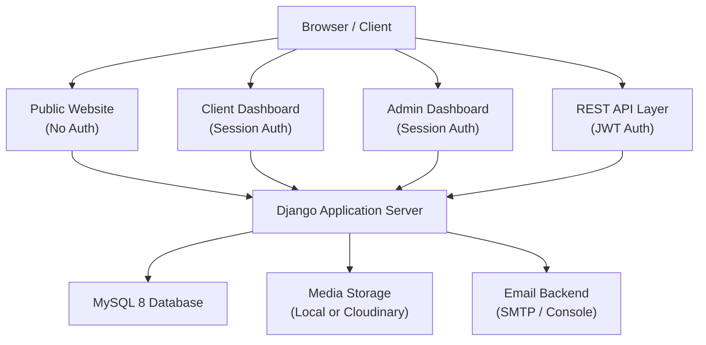
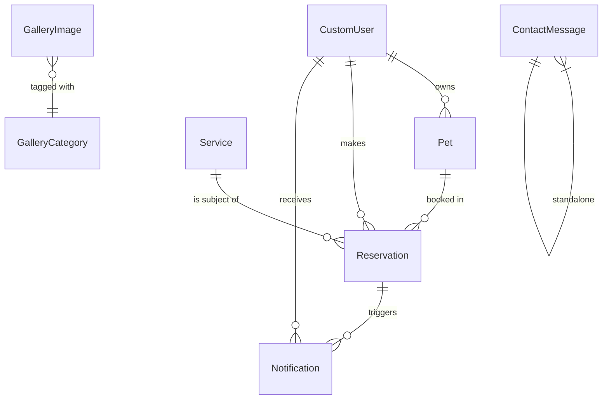
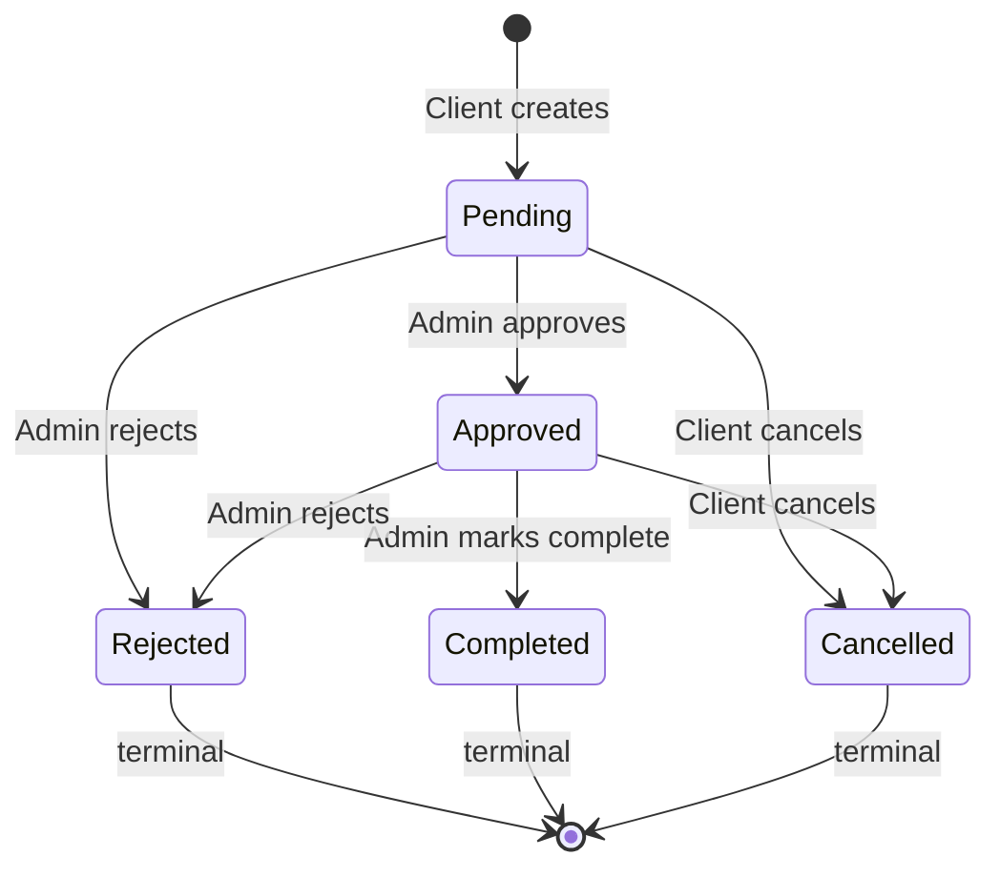

# Design Document — VIPET Luxury Pet Hotel Management Platform

## Overview

VIPET is a full-stack Django 5 web application that serves two audiences: **Clients** (pet owners) who register, manage pets, and book services; and **Administrators** who manage the full platform. The system is composed of a public-facing marketing website, role-differentiated authenticated dashboards, a REST-style API layer secured by JWT, and a pluggable media storage backend (local filesystem or Cloudinary).

### Technology Stack

| Layer | Technology |
|---|---|
| Backend runtime | Python 3.11+, Django 5.0+ |
| Database | MySQL 8.0+ (via `mysqlclient` or `PyMySQL`) |
| REST Auth | `djangorestframework-simplejwt` |
| Frontend CSS | Tailwind CSS (CDN/PostCSS build) |
| Frontend JS | Alpine.js |
| Media (primary) | Django `MEDIA_ROOT` (local) |
| Media (optional) | Cloudinary (via `cloudinary-storage`) |
| Fonts | Bodoni Moda (headings), Jost (body) |

### Brand Tokens

```
Primary  : #FF007F
Dark     : #1A1A1A
White    : #FFFFFF
Light Pink: #FFE0EF
Gray     : #666666
```

---

## Architecture

### High-Level Architecture Diagram



### Django Project Layout

```
vipet/                          # project root
├── manage.py
├── vipet/                      # project config package
│   ├── __init__.py
│   ├── settings/
│   │   ├── base.py             # shared settings
│   │   ├── development.py      # DEBUG=True, console email
│   │   └── production.py       # HTTPS, Cloudinary, real SMTP
│   ├── urls.py                 # root URL config
│   ├── wsgi.py
│   └── asgi.py
├── apps/
│   ├── accounts/               # user registration, login, profiles, JWT
│   ├── pets/                   # pet management
│   ├── services/               # hotel services (admin CRUD)
│   ├── reservations/           # reservation lifecycle
│   ├── notifications/          # in-app notification system
│   ├── gallery/                # gallery images
│   ├── contact/                # contact form
│   └── dashboard/              # dashboard aggregation views (no models)
├── templates/
│   ├── base.html               # root layout
│   ├── public/                 # home, about, services, gallery, pricing, contact
│   ├── accounts/               # login, register, profile, password reset
│   ├── dashboard/
│   │   ├── admin/              # admin dashboard pages
│   │   └── client/             # client dashboard pages
│   └── components/             # reusable partials (navbar, sidebar, cards)
├── static/
│   ├── css/
│   │   └── output.css          # compiled Tailwind output
│   ├── js/
│   │   └── app.js              # Alpine.js app bootstrap
│   └── images/                 # static brand assets
├── media/                      # uploaded files (MEDIA_ROOT, gitignored)
│   ├── profiles/
│   ├── pets/
│   ├── services/
│   └── gallery/
├── requirements.txt
├── tailwind.config.js
└── .env                        # secrets (gitignored)
```

### App Responsibility Matrix

| App | Responsibility |
|---|---|
| `accounts` | CustomUser model, registration, login/logout, JWT endpoints, password reset, profile editing |
| `pets` | Pet model, CRUD views for clients |
| `services` | Service model, admin CRUD, public listing |
| `reservations` | Reservation model, creation (client), status transitions (admin) |
| `notifications` | Notification model, creation on reservation events, read/unread |
| `gallery` | GalleryImage model, admin upload/delete, public display |
| `contact` | ContactMessage model, public form submission, admin read |
| `dashboard` | Aggregation views; no models — imports from other apps |

---

## Components and Interfaces

### URL Routing Structure

```
/                                   → public:home
/about/                             → public:about
/services/                          → public:services
/pricing/                           → public:pricing
/gallery/                           → public:gallery
/contact/                           → public:contact

/accounts/register/                 → accounts:register
/accounts/login/                    → accounts:login
/accounts/logout/                   → accounts:logout
/accounts/password-reset/           → accounts:password_reset
/accounts/password-reset/<uidb64>/<token>/  → accounts:password_reset_confirm
/accounts/profile/                  → accounts:profile  (login required)

/client/                            → client_dashboard:home
/client/pets/                       → client_dashboard:pets
/client/pets/add/                   → client_dashboard:pets_add
/client/pets/<id>/edit/             → client_dashboard:pets_edit
/client/pets/<id>/delete/           → client_dashboard:pets_delete
/client/reservations/               → client_dashboard:reservations
/client/reservations/create/        → client_dashboard:reservations_create
/client/reservations/<id>/cancel/   → client_dashboard:reservations_cancel
/client/notifications/              → client_dashboard:notifications

/admin-panel/                       → admin_dashboard:home
/admin-panel/users/                 → admin_dashboard:users
/admin-panel/pets/                  → admin_dashboard:pets
/admin-panel/services/              → admin_dashboard:services
/admin-panel/services/add/          → admin_dashboard:services_add
/admin-panel/services/<id>/edit/    → admin_dashboard:services_edit
/admin-panel/services/<id>/delete/  → admin_dashboard:services_delete
/admin-panel/reservations/          → admin_dashboard:reservations
/admin-panel/reservations/<id>/     → admin_dashboard:reservations_detail
/admin-panel/gallery/               → admin_dashboard:gallery
/admin-panel/gallery/add/           → admin_dashboard:gallery_add
/admin-panel/gallery/<id>/delete/   → admin_dashboard:gallery_delete
/admin-panel/contact/               → admin_dashboard:contact

# REST API (JWT secured)
/api/v1/token/                      → simplejwt:token_obtain_pair
/api/v1/token/refresh/              → simplejwt:token_refresh
/api/v1/token/verify/               → simplejwt:token_verify
/api/v1/notifications/              → api:notifications_list
/api/v1/notifications/<id>/read/    → api:notification_read
/api/v1/notifications/unread-count/ → api:notification_unread_count
```

### View Classes and Mixins

```python
# apps/accounts/views.py
class RegisterView(FormView): ...
class LoginView(FormView): ...
class LogoutView(View): ...
class PasswordResetRequestView(FormView): ...
class PasswordResetConfirmView(FormView): ...
class ProfileView(LoginRequiredMixin, UpdateView): ...

# apps/pets/views.py
class PetListView(LoginRequiredMixin, ClientRequiredMixin, ListView): ...
class PetCreateView(LoginRequiredMixin, ClientRequiredMixin, CreateView): ...
class PetUpdateView(LoginRequiredMixin, ClientRequiredMixin, UpdateView): ...
class PetDeleteView(LoginRequiredMixin, ClientRequiredMixin, DeleteView): ...

# apps/services/views.py  (public)
class ServiceListView(ListView): ...
# apps/services/views.py  (admin)
class AdminServiceListView(AdminRequiredMixin, ListView): ...
class AdminServiceCreateView(AdminRequiredMixin, CreateView): ...
class AdminServiceUpdateView(AdminRequiredMixin, UpdateView): ...
class AdminServiceDeleteView(AdminRequiredMixin, DeleteView): ...

# apps/reservations/views.py  (client)
class ReservationListView(LoginRequiredMixin, ClientRequiredMixin, ListView): ...
class ReservationCreateView(LoginRequiredMixin, ClientRequiredMixin, CreateView): ...
class ReservationCancelView(LoginRequiredMixin, ClientRequiredMixin, View): ...
# apps/reservations/views.py  (admin)
class AdminReservationListView(AdminRequiredMixin, ListView): ...
class AdminReservationUpdateView(AdminRequiredMixin, View): ...

# apps/notifications/views.py
class NotificationListView(LoginRequiredMixin, ClientRequiredMixin, ListView): ...
# apps/notifications/api_views.py  (DRF)
class NotificationListAPIView(IsAuthenticated, generics.ListAPIView): ...
class NotificationReadAPIView(IsAuthenticated, generics.UpdateAPIView): ...
class UnreadCountAPIView(IsAuthenticated, generics.RetrieveAPIView): ...

# apps/gallery/views.py
class GalleryPublicView(ListView): ...
class AdminGalleryListView(AdminRequiredMixin, ListView): ...
class AdminGalleryCreateView(AdminRequiredMixin, CreateView): ...
class AdminGalleryDeleteView(AdminRequiredMixin, DeleteView): ...

# apps/contact/views.py
class ContactFormView(FormView): ...
class AdminContactListView(AdminRequiredMixin, ListView): ...

# apps/dashboard/views.py
class ClientDashboardHomeView(LoginRequiredMixin, ClientRequiredMixin, TemplateView): ...
class AdminDashboardHomeView(AdminRequiredMixin, TemplateView): ...
```

### Custom Mixins

```python
# apps/core/mixins.py

class ClientRequiredMixin(UserPassesTestMixin):
    """Passes only if request.user.role == 'client'. Returns 403 otherwise."""
    def test_func(self) -> bool:
        return self.request.user.is_authenticated and self.request.user.role == "client"

class AdminRequiredMixin(UserPassesTestMixin):
    """Passes only if request.user.role == 'admin'. Returns 403 otherwise."""
    def test_func(self) -> bool:
        return self.request.user.is_authenticated and self.request.user.role == "admin"
```

---

## Data Models

### Entity-Relationship Overview



### Model Definitions

#### `accounts.CustomUser`

```python
class CustomUser(AbstractBaseUser, PermissionsMixin):
    ROLE_CHOICES = [("client", "Client"), ("admin", "Admin")]

    id            = BigAutoField(primary_key=True)
    email         = EmailField(unique=True, max_length=254)
    first_name    = CharField(max_length=50)
    last_name     = CharField(max_length=50)
    phone_number  = CharField(max_length=20, blank=True)
    role          = CharField(max_length=10, choices=ROLE_CHOICES, default="client")
    profile_photo = ImageField(upload_to="profiles/", null=True, blank=True)
    is_active     = BooleanField(default=True)
    is_staff      = BooleanField(default=False)  # Django admin access
    date_joined   = DateTimeField(auto_now_add=True)

    USERNAME_FIELD  = "email"
    REQUIRED_FIELDS = ["first_name", "last_name"]

    objects = CustomUserManager()
```

**Indexes:** `email` (unique), `role`, `date_joined`

#### `pets.Pet`

```python
class Pet(Model):
    GENDER_CHOICES = [("male", "Male"), ("female", "Female")]

    id                = BigAutoField(primary_key=True)
    owner             = ForeignKey(CustomUser, on_delete=CASCADE, related_name="pets")
    name              = CharField(max_length=100)
    species           = CharField(max_length=100)
    breed             = CharField(max_length=100, blank=True)
    gender            = CharField(max_length=10, choices=GENDER_CHOICES)
    age               = PositiveSmallIntegerField()     # 0–30 validated at form
    weight            = DecimalField(max_digits=5, decimal_places=2)  # 0.1–200 kg
    medical_notes     = TextField(max_length=2000, blank=True)
    is_vaccinated     = BooleanField(default=False)
    photo             = ImageField(upload_to="pets/", null=True, blank=True)
    created_at        = DateTimeField(auto_now_add=True)
    updated_at        = DateTimeField(auto_now=True)
```

**Indexes:** `owner`, `species`

#### `services.Service`

```python
class Service(Model):
    CATEGORY_CHOICES = [
        ("luxury_suite",       "Luxury Suite"),
        ("grooming",           "Grooming"),
        ("spa",                "Spa"),
        ("daycare",            "Daycare"),
        ("training",           "Training"),
        ("veterinary_checkup", "Veterinary Checkup"),
        ("birthday_events",    "Birthday Events"),
    ]

    id           = BigAutoField(primary_key=True)
    name         = CharField(max_length=100)
    category     = CharField(max_length=30, choices=CATEGORY_CHOICES)
    description  = TextField(max_length=1000)
    price        = DecimalField(max_digits=8, decimal_places=2)  # MAD, 0.01–9999.99
    is_available = BooleanField(default=True)
    image        = ImageField(upload_to="services/", null=True, blank=True)
    created_at   = DateTimeField(auto_now_add=True)
    updated_at   = DateTimeField(auto_now=True)
```

**Indexes:** `is_available`, `category`

#### `reservations.Reservation`

```python
class Reservation(Model):
    STATUS_CHOICES = [
        ("pending",   "Pending"),
        ("approved",  "Approved"),
        ("rejected",  "Rejected"),
        ("completed", "Completed"),
        ("cancelled", "Cancelled"),
    ]

    # Allowed state transitions (from → to)
    ALLOWED_TRANSITIONS = {
        "pending":  {"approved", "rejected"},
        "approved": {"completed", "rejected"},
        # rejected, completed, cancelled are terminal
    }

    id          = BigAutoField(primary_key=True)
    client      = ForeignKey(CustomUser, on_delete=CASCADE, related_name="reservations")
    pet         = ForeignKey(Pet, on_delete=CASCADE, related_name="reservations")
    service     = ForeignKey(Service, on_delete=CASCADE, related_name="reservations")
    start_date  = DateField()
    end_date    = DateField()
    status      = CharField(max_length=20, choices=STATUS_CHOICES, default="pending")
    total_price = DecimalField(max_digits=10, decimal_places=2)
    notes       = TextField(max_length=500, blank=True)
    created_at  = DateTimeField(auto_now_add=True)
    updated_at  = DateTimeField(auto_now=True)
```

**Indexes:** `client`, `status`, `start_date`, `created_at`

#### `notifications.Notification`

```python
class Notification(Model):
    id          = BigAutoField(primary_key=True)
    user        = ForeignKey(CustomUser, on_delete=CASCADE, related_name="notifications")
    reservation = ForeignKey(Reservation, on_delete=CASCADE, related_name="notifications")
    message     = TextField()
    is_read     = BooleanField(default=False)
    created_at  = DateTimeField(auto_now_add=True)
```

**Indexes:** `user`, `is_read`, `created_at`

#### `gallery.GalleryImage`

```python
class GalleryCategory(TextChoices):
    SUITES       = "suites",       "Suites"
    GROOMING     = "grooming",     "Grooming Area"
    SPA          = "spa",          "Spa Services"
    HAPPY_PETS   = "happy_pets",   "Happy Pets"

class GalleryImage(Model):
    id         = BigAutoField(primary_key=True)
    title      = CharField(max_length=100)
    category   = CharField(max_length=20, choices=GalleryCategory.choices)
    image      = ImageField(upload_to="gallery/")
    created_at = DateTimeField(auto_now_add=True)
```

**Indexes:** `category`

#### `contact.ContactMessage`

```python
class ContactMessage(Model):
    id           = BigAutoField(primary_key=True)
    name         = CharField(max_length=100)
    email        = EmailField()
    subject      = CharField(max_length=150)
    message      = TextField(max_length=2000)
    submitted_at = DateTimeField(auto_now_add=True)
```

**Indexes:** `submitted_at`

---

## Authentication System Design

### Dual Authentication Strategy

VIPET uses **two complementary authentication mechanisms** targeting different clients:

| Client Type | Mechanism | Use Case |
|---|---|---|
| Browser (HTML pages) | Django session cookie | Dashboard, profile, pet management pages |
| API consumers / Alpine.js | JWT (access + refresh) | Notification badge polling, SPA-like interactions |

This lets server-rendered views use Django's built-in `@login_required` while the notification API (polled by Alpine.js) uses lightweight JWT headers.

### Session Authentication Flow

```
POST /accounts/login/
  → authenticate(email, password)
  → login(request, user)          # creates session, sets cookie
  → redirect by role:
      role == "admin"  → /admin-panel/
      role == "client" → /client/
```

### JWT Authentication Flow

```
POST /api/v1/token/
  Body: {"email": "...", "password": "..."}
  Response: {"access": "<60-min token>", "refresh": "<7-day token>"}

POST /api/v1/token/refresh/
  Body: {"refresh": "<token>"}
  Response: {"access": "<new access token>"}

# All /api/v1/* endpoints:
  Request Header: Authorization: Bearer <access token>
  → 401 if missing or expired
  → 403 if wrong role
```

### JWT Settings

```python
# vipet/settings/base.py
from datetime import timedelta
SIMPLE_JWT = {
    "ACCESS_TOKEN_LIFETIME":  timedelta(minutes=60),
    "REFRESH_TOKEN_LIFETIME": timedelta(days=7),
    "ROTATE_REFRESH_TOKENS":  False,
    "AUTH_HEADER_TYPES":      ("Bearer",),
    "USER_ID_FIELD":          "id",
    "USER_ID_CLAIM":          "user_id",
}
```

### Password Reset Token Flow

```
1. User → POST /accounts/password-reset/  {email}
2. System generates PasswordResetTokenGenerator token (Django built-in)
3. Email sent to user with link: /accounts/password-reset/<uidb64>/<token>/
4. Link valid for 60 minutes (PASSWORD_RESET_TIMEOUT = 3600)
5. User submits new password → token validated → password updated → token consumed
6. If email not registered → same "check your email" response (no enumeration)
```

### Rate Limiting for Login

```python
# apps/accounts/views.py — LoginView.post()
# Uses django-ratelimit or a manual Redis/cache counter:
#   key   = f"login_fail:{request.META['REMOTE_ADDR']}"
#   limit = 5 attempts in 900 seconds (15 minutes)
#   On exceed → 429 response + error in form
```

---

## Dashboard Design

### Admin Dashboard — Statistics Queries

```python
# apps/dashboard/views.py

from django.db.models import Sum, Count, Q
from django.utils import timezone

def get_admin_stats(request):
    now   = timezone.now()
    month_start = now.replace(day=1, hour=0, minute=0, second=0, microsecond=0)

    total_clients = CustomUser.objects.filter(role="client").count()
    total_pets    = Pet.objects.count()
    active_reservations = Reservation.objects.filter(
        status__in=["pending", "approved"]
    ).count()

    monthly_revenue = (
        Reservation.objects
        .filter(status="completed", end_date__gte=month_start, end_date__lte=now)
        .aggregate(total=Sum("total_price"))["total"] or Decimal("0.00")
    )

    top_service = (
        Reservation.objects
        .filter(created_at__gte=month_start)
        .values("service__name")
        .annotate(count=Count("id"))
        .order_by("-count", "service__name")
        .first()
    )

    return {
        "total_clients":        total_clients,
        "total_pets":           total_pets,
        "active_reservations":  active_reservations,
        "monthly_revenue":      monthly_revenue,
        "top_service":          top_service["service__name"] if top_service else None,
    }
```

### Client Dashboard — Summary Queries

```python
def get_client_stats(user):
    pet_count = Pet.objects.filter(owner=user).count()
    active_reservation_count = Reservation.objects.filter(
        client=user, status__in=["pending", "approved"]
    ).count()
    unread_notifications = Notification.objects.filter(
        user=user, is_read=False
    ).count()
    return {
        "pet_count":               pet_count,
        "active_reservation_count": active_reservation_count,
        "unread_notifications":     unread_notifications,
    }
```

### Admin Filtering Logic

```python
# Reservation filter  (apps/reservations/filters.py)
class ReservationFilter(FilterSet):
    status     = ChoiceFilter(choices=Reservation.STATUS_CHOICES)
    start_date = DateFilter(field_name="start_date", lookup_expr="gte")
    end_date   = DateFilter(field_name="end_date",   lookup_expr="lte")
    class Meta:
        model  = Reservation
        fields = ["status", "start_date", "end_date"]

# User filter
class UserFilter(FilterSet):
    email          = CharFilter(lookup_expr="icontains")
    date_joined_from = DateFilter(field_name="date_joined", lookup_expr="date__gte")
    date_joined_to   = DateFilter(field_name="date_joined", lookup_expr="date__lte")
    class Meta:
        model  = CustomUser
        fields = ["email", "date_joined_from", "date_joined_to"]
```

---

## Reservation State Machine



### Transition Enforcement

```python
# apps/reservations/services.py

ALLOWED_ADMIN_TRANSITIONS = {
    "pending":  {"approved", "rejected"},
    "approved": {"completed", "rejected"},
}
ALLOWED_CLIENT_CANCELLATION = {"pending", "approved"}

def transition_reservation(reservation: Reservation, new_status: str, actor: CustomUser) -> None:
    """
    Apply a status transition, create a notification, and save.
    Raises ValueError on invalid transition.
    """
    current = reservation.status

    if actor.role == "admin":
        allowed = ALLOWED_ADMIN_TRANSITIONS.get(current, set())
        if new_status not in allowed:
            raise ValueError(f"Cannot transition from '{current}' to '{new_status}'.")
    elif actor.role == "client" and new_status == "cancelled":
        if current not in ALLOWED_CLIENT_CANCELLATION:
            raise ValueError(f"Cannot cancel a reservation with status '{current}'.")
    else:
        raise PermissionError("Unauthorized transition.")

    reservation.status = new_status
    reservation.save(update_fields=["status", "updated_at"])
    _create_notification(reservation)


def _create_notification(reservation: Reservation) -> None:
    STATUS_MESSAGES = {
        "approved":  "Your reservation for {pet} ({service}) has been approved.",
        "rejected":  "Your reservation for {pet} ({service}) has been rejected.",
        "completed": "Your stay for {pet} at {service} has been completed. Thank you!",
    }
    template = STATUS_MESSAGES.get(reservation.status)
    if not template:
        return
    message = template.format(
        pet=reservation.pet.name,
        service=reservation.service.name,
    )
    Notification.objects.create(
        user=reservation.client,
        reservation=reservation,
        message=message,
    )
```

### Total Price Calculation

```python
# apps/reservations/utils.py

from decimal import Decimal

def calculate_total_price(service: Service, start_date: date, end_date: date) -> Decimal:
    """
    Total = service.price × (end_date - start_date) in whole days.
    Precondition: end_date > start_date (validated by form).
    """
    days = (end_date - start_date).days   # integer ≥ 1
    return service.price * Decimal(days)
```

---

## Forms Design

```python
# apps/accounts/forms.py

class RegistrationForm(ModelForm):
    password     = CharField(widget=PasswordInput, min_length=8, max_length=128)
    password2    = CharField(widget=PasswordInput, label="Confirm Password")

    def clean_email(self):
        email = self.cleaned_data["email"]
        if CustomUser.objects.filter(email=email).exists():
            raise ValidationError("This email address is already registered.")
        return email

    def clean(self):
        cleaned = super().clean()
        if cleaned.get("password") != cleaned.get("password2"):
            self.add_error("password2", "Passwords do not match.")
        return cleaned

    class Meta:
        model  = CustomUser
        fields = ["first_name", "last_name", "email", "phone_number", "password"]


class ProfileUpdateForm(ModelForm):
    """Email field is excluded — read-only in the template."""
    class Meta:
        model  = CustomUser
        fields = ["first_name", "last_name", "phone_number", "profile_photo"]


# apps/pets/forms.py

class PetForm(ModelForm):
    def clean_age(self):
        age = self.cleaned_data.get("age", 0)
        if not (0 <= age <= 30):
            raise ValidationError("Age must be between 0 and 30.")
        return age

    def clean_weight(self):
        w = self.cleaned_data.get("weight")
        if w is not None and not (Decimal("0.1") <= w <= Decimal("200")):
            raise ValidationError("Weight must be between 0.1 and 200 kg.")
        return w

    class Meta:
        model  = Pet
        fields = ["name", "species", "breed", "gender", "age", "weight",
                  "medical_notes", "is_vaccinated", "photo"]


# apps/reservations/forms.py

class ReservationCreateForm(ModelForm):
    def __init__(self, *args, user=None, **kwargs):
        super().__init__(*args, **kwargs)
        if user:
            self.fields["pet"].queryset = Pet.objects.filter(owner=user)
            self.fields["service"].queryset = Service.objects.filter(is_available=True)

    def clean(self):
        cleaned    = super().clean()
        start_date = cleaned.get("start_date")
        end_date   = cleaned.get("end_date")
        if start_date and start_date < date.today():
            self.add_error("start_date", "Start date cannot be in the past.")
        if start_date and end_date and end_date <= start_date:
            self.add_error("end_date", "End date must be at least one day after start date.")
        return cleaned

    class Meta:
        model  = Reservation
        fields = ["pet", "service", "start_date", "end_date", "notes"]


# apps/contact/forms.py

class ContactMessageForm(ModelForm):
    class Meta:
        model  = ContactMessage
        fields = ["name", "email", "subject", "message"]
```

---

## Media Storage Design

### Switchable Backend Architecture

```python
# vipet/settings/base.py

import os
from pathlib import Path

BASE_DIR = Path(__file__).resolve().parent.parent.parent
MEDIA_URL  = "/media/"
MEDIA_ROOT = BASE_DIR / "media"

CLOUDINARY_CLOUD_NAME = os.getenv("CLOUDINARY_CLOUD_NAME", "")
CLOUDINARY_API_KEY    = os.getenv("CLOUDINARY_API_KEY", "")
CLOUDINARY_API_SECRET = os.getenv("CLOUDINARY_API_SECRET", "")

if CLOUDINARY_CLOUD_NAME and CLOUDINARY_API_KEY and CLOUDINARY_API_SECRET:
    import cloudinary
    cloudinary.config(
        cloud_name = CLOUDINARY_CLOUD_NAME,
        api_key    = CLOUDINARY_API_KEY,
        api_secret = CLOUDINARY_API_SECRET,
    )
    DEFAULT_FILE_STORAGE = "cloudinary_storage.storage.MediaCloudinaryStorage"
else:
    DEFAULT_FILE_STORAGE = "django.core.files.storage.FileSystemStorage"
```

### Upload Validation Mixin

```python
# apps/core/validators.py

from django.core.exceptions import ValidationError
import magic  # python-magic

ALLOWED_MIME_TYPES = {"image/jpeg", "image/png", "image/webp"}

def validate_image_file(file, max_size_mb: int = 5) -> None:
    """
    Validates MIME type (via libmagic) and file size.
    Raises ValidationError with a specific reason message.
    """
    max_bytes = max_size_mb * 1024 * 1024
    # Read first 2048 bytes for MIME detection without loading the whole file
    header    = file.read(2048)
    file.seek(0)
    mime = magic.from_buffer(header, mime=True)

    if mime not in ALLOWED_MIME_TYPES:
        raise ValidationError(
            f"Invalid file format '{mime}'. Only JPEG, PNG, and WebP are accepted."
        )
    if file.size > max_bytes:
        raise ValidationError(
            f"File size {file.size / (1024*1024):.1f} MB exceeds the {max_size_mb} MB limit."
        )
```

### Per-Entity Upload Paths and Limits

| Entity | `upload_to` | Max Size |
|---|---|---|
| `CustomUser.profile_photo` | `profiles/` | 5 MB |
| `Pet.photo` | `pets/` | 5 MB |
| `Service.image` | `services/` | 5 MB |
| `GalleryImage.image` | `gallery/` | 10 MB |

---

## Notification API (REST)

```python
# apps/notifications/serializers.py

class NotificationSerializer(ModelSerializer):
    pet_name     = SerializerMethodField()
    service_name = SerializerMethodField()

    def get_pet_name(self, obj):
        return obj.reservation.pet.name

    def get_service_name(self, obj):
        return obj.reservation.service.name

    class Meta:
        model  = Notification
        fields = ["id", "message", "is_read", "created_at", "pet_name", "service_name"]


# apps/notifications/api_views.py

class NotificationListAPIView(generics.ListAPIView):
    serializer_class   = NotificationSerializer
    permission_classes = [IsAuthenticated]

    def get_queryset(self):
        return Notification.objects.filter(
            user=self.request.user
        ).order_by("-created_at")


class NotificationMarkReadAPIView(generics.UpdateAPIView):
    serializer_class   = NotificationSerializer
    permission_classes = [IsAuthenticated]
    http_method_names  = ["patch"]

    def get_queryset(self):
        return Notification.objects.filter(user=self.request.user)

    def partial_update(self, request, *args, **kwargs):
        instance = self.get_object()
        instance.is_read = True
        instance.save(update_fields=["is_read"])
        return Response({"status": "ok"})


class UnreadCountAPIView(generics.RetrieveAPIView):
    permission_classes = [IsAuthenticated]

    def retrieve(self, request, *args, **kwargs):
        count = Notification.objects.filter(
            user=request.user, is_read=False
        ).count()
        return Response({"unread_count": count})
```

---

## Template Structure

### Base Layout (`templates/base.html`)

```html
<!DOCTYPE html>
<html lang="en" x-data="vipetApp()">
<head>
  <meta charset="UTF-8" />
  <meta name="viewport" content="width=device-width, initial-scale=1.0" />
  <title>VIPET</title>
  
  <link rel="stylesheet" href="">
  <!-- Fonts: Bodoni Moda + Jost from Google Fonts -->
  <link href="https://fonts.googleapis.com/css2?family=Bodoni+Moda:opsz@6..96&family=Jost:wght@300;400;500;600&display=swap" rel="stylesheet">
</head>
<body class="font-jost bg-white text-dark">
  
  
  
  <script src=""></script>
  <script defer src="https://cdn.jsdelivr.net/npm/alpinejs@3.x.x/dist/cdn.min.js"></script>
</body>
</html>
```

### Template Hierarchy

```
templates/
├── base.html                      # root: font, CSS, Alpine.js
├── base_dashboard.html            # extends base: sidebar layout
├── components/
│   ├── navbar.html                # public nav with login/register CTA
│   ├── dashboard_sidebar_admin.html
│   ├── dashboard_sidebar_client.html
│   ├── footer.html
│   ├── notification_badge.html    # Alpine.js polling badge
│   ├── flash_messages.html        # success/error banners
│   └── pet_card.html
├── public/
│   ├── home.html
│   ├── about.html
│   ├── services.html
│   ├── pricing.html
│   ├── gallery.html
│   └── contact.html
├── accounts/
│   ├── register.html
│   ├── login.html
│   ├── profile.html
│   ├── password_reset.html
│   └── password_reset_confirm.html
├── dashboard/
│   ├── admin/
│   │   ├── home.html              # stats widgets
│   │   ├── users.html
│   │   ├── pets.html
│   │   ├── services.html
│   │   ├── services_form.html
│   │   ├── reservations.html
│   │   ├── reservation_detail.html
│   │   ├── gallery.html
│   │   └── contact.html
│   └── client/
│       ├── home.html              # pet count, active reservation count
│       ├── pets.html
│       ├── pets_form.html
│       ├── reservations.html
│       ├── reservations_form.html
│       └── notifications.html
```

### Alpine.js Notification Badge Component

```javascript
// static/js/app.js

function vipetApp() {
    return {
        unreadCount: 0,
        init() {
            this.fetchUnreadCount();
            // Poll every 60 seconds
            setInterval(() => this.fetchUnreadCount(), 60000);
        },
        fetchUnreadCount() {
            const token = localStorage.getItem("access_token");
            if (!token) return;
            fetch("/api/v1/notifications/unread-count/", {
                headers: { "Authorization": `Bearer ${token}` }
            })
            .then(r => r.json())
            .then(data => { this.unreadCount = data.unread_count; })
            .catch(() => {});
        },
        markRead(notificationId) {
            const token = localStorage.getItem("access_token");
            fetch(`/api/v1/notifications/${notificationId}/read/`, {
                method: "PATCH",
                headers: {
                    "Authorization": `Bearer ${token}`,
                    "X-CSRFToken": getCookie("csrftoken"),
                }
            })
            .then(() => { if (this.unreadCount > 0) this.unreadCount--; });
        }
    }
}
```

---

## Security Design

### CSRF Protection

All POST forms include ``. DRF views are exempt via `SessionAuthentication` (CSRF enforced) or `JWTAuthentication` (stateless, CSRF not applicable for API). Any HTML form using non-GET methods includes the token.

### Security Settings

```python
# vipet/settings/production.py

SECURE_SSL_REDIRECT          = True
SESSION_COOKIE_SECURE        = True
CSRF_COOKIE_SECURE           = True
SECURE_HSTS_SECONDS          = 31536000
SECURE_HSTS_INCLUDE_SUBDOMAINS = True
SECURE_HSTS_PRELOAD          = True
SECURE_CONTENT_TYPE_NOSNIFF  = True
X_FRAME_OPTIONS              = "DENY"
SESSION_COOKIE_HTTPONLY      = True
CSRF_COOKIE_HTTPONLY         = True
```

### Access Control Summary

| Endpoint type | Guard mechanism |
|---|---|
| Public HTML pages | No guard |
| Client-only pages | `LoginRequiredMixin` + `ClientRequiredMixin` (403 on fail) |
| Admin-only pages | `AdminRequiredMixin` (403 on fail) |
| Protected API endpoints | `IsAuthenticated` permission class (401 on fail) |
| Login/Register (authenticated redirect) | Role-redirect in `LoginView.dispatch` |

---

## Error Handling

### View-Level Error Handling

```python
# apps/core/views.py  (custom error handlers)

def handler403(request, exception=None):
    return render(request, "errors/403.html", status=403)

def handler404(request, exception=None):
    return render(request, "errors/404.html", status=404)

def handler500(request):
    return render(request, "errors/500.html", status=500)
```

```python
# vipet/urls.py
handler403 = "apps.core.views.handler403"
handler404 = "apps.core.views.handler404"
handler500 = "apps.core.views.handler500"
```

### Service-Layer Error Handling

- `transition_reservation()` raises `ValueError` on invalid state transition — caught in the view and rendered as a form error.
- `ContactFormView.form_valid()` wraps `ContactMessage.save()` in a try/except and re-renders the form with an error on `IntegrityError` or `DatabaseError`.
- File upload validation raises `ValidationError` before any write to storage (`validate_image_file` called in `ModelForm.clean_<field>`).

### API Error Responses

```json
// 401 Unauthorized
{"detail": "Authentication credentials were not provided."}

// 403 Forbidden
{"detail": "You do not have permission to perform this action."}

// 400 Bad Request (transition error)
{"error": "Cannot transition from 'completed' to 'approved'."}
```

---

## Testing Strategy

### Overview

The test suite uses a **dual testing approach**:

1. **Unit / example-based tests** — specific scenarios and edge cases using Django's `TestCase`
2. **Property-based tests** — universal behavioral properties using **Hypothesis**

Both layers run in the same `pytest` (with `pytest-django`) invocation.

### Test Configuration

```toml
# pyproject.toml
[tool.pytest.ini_options]
DJANGO_SETTINGS_MODULE = "vipet.settings.development"
python_files            = ["tests.py", "test_*.py"]

[tool.hypothesis]
max_examples = 100
```

### Unit Test Examples

```python
# apps/reservations/tests/test_transitions.py

class ReservationTransitionTests(TestCase):
    def test_admin_approves_pending(self): ...
    def test_admin_cannot_approve_completed(self): ...
    def test_client_cancel_approved(self): ...
    def test_client_cannot_cancel_completed(self): ...

# apps/accounts/tests/test_registration.py

class RegistrationTests(TestCase):
    def test_valid_registration_creates_user(self): ...
    def test_duplicate_email_rejected(self): ...
    def test_short_password_rejected(self): ...
    def test_password_mismatch_rejected(self): ...
```

### Property-Based Tests (Hypothesis)

Property tests are detailed in the **Correctness Properties** section below. Each property test uses `@given` decorators and runs at minimum 100 examples.

```python
# Tag format in test docstrings:
# Feature: vipet-luxury-pet-hotel, Property N: <property text>
```

---

## Correctness Properties

*A property is a characteristic or behavior that should hold true across all valid executions of a system — essentially, a formal statement about what the system should do. Properties serve as the bridge between human-readable specifications and machine-verifiable correctness guarantees.*

---

### Property 1: Total Price Calculation Is Consistent

*For any* available Service with a valid price and any pair of dates (start, end) where end > start, the computed total price SHALL equal `service.price × (end_date − start_date).days`, and SHALL be a non-negative Decimal.

**Validates: Requirements 7.1**

---

### Property 2: Reservation Status Transition Validity

*For any* Reservation in any state, attempting a status transition not in the allowed set (Pending → Approved/Rejected; Approved → Completed/Rejected; terminal states have no allowed transitions) SHALL raise a `ValueError` and leave the Reservation status unchanged.

**Validates: Requirements 9.5**

---

### Property 3: Notification Created on Every Valid Status Transition

*For any* Reservation that undergoes a valid admin-initiated status transition to Approved, Rejected, or Completed, exactly one new Notification SHALL be created for the owning Client referencing that Reservation, and the unread notification count for that Client SHALL increase by exactly one.

**Validates: Requirements 10.1, 10.2, 10.3**

---

### Property 4: Notification Read/Unread Round Trip

*For any* Client with N unread notifications, marking any single unread Notification as read SHALL result in exactly N−1 unread notifications for that Client. Reading an already-read notification SHALL leave the unread count unchanged.

**Validates: Requirements 10.5, 10.6**

---

### Property 5: Upload Validation Rejects All Non-Allowed MIME Types

*For any* uploaded file whose MIME type is not one of {image/jpeg, image/png, image/webp}, the `validate_image_file` function SHALL raise a `ValidationError` and SHALL NOT write any bytes to the storage backend.

**Validates: Requirements 17.2, 17.4**

---

### Property 6: Upload Validation Rejects Files Exceeding Size Limit

*For any* uploaded file whose byte size exceeds the per-entity limit (5 MB for profiles/pets/services; 10 MB for gallery), the `validate_image_file` function SHALL raise a `ValidationError` with a message referencing the size limit, and SHALL NOT write any bytes to the storage backend.

**Validates: Requirements 17.3, 17.4**

---

### Property 7: Pet Deletion Blocked When Active Reservations Exist

*For any* Pet that has one or more Reservations with status Pending or Approved, a deletion attempt SHALL be rejected with an error message, and the Pet record SHALL remain in the database. *For any* Pet with no active reservations, the deletion SHALL succeed and the Pet record SHALL no longer exist in the database.

**Validates: Requirements 5.4**

---

### Property 8: Whitespace-Only and Empty Inputs Are Rejected by Validation

*For any* form field with a minimum length of 1 character, submitting a value composed entirely of whitespace characters SHALL fail validation and the associated model record SHALL NOT be created or updated.

**Validates: Requirements 1.5, 15.2**

---

### Property 9: Client Data Isolation

*For any* Client A and Client B (A ≠ B), a request by Client A to access, modify, or delete a Pet, Reservation, or profile record owned by Client B SHALL return a 403 Forbidden response, and no data belonging to Client B SHALL be modified.

**Validates: Requirements 12.4, 16.2**

---

### Property 10: Monthly Revenue Is Sum of Completed Reservations in Current Month

*For any* set of Reservations in the database, the monthly revenue figure displayed on the Admin Dashboard SHALL equal the exact sum of `total_price` of all Reservations whose `status` is `"completed"` and whose `end_date` falls within the current calendar month — no more, no less.

**Validates: Requirements 11.1**

---
