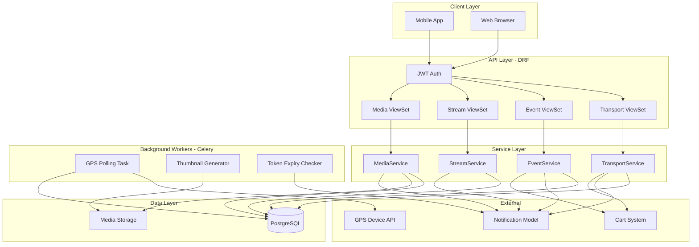
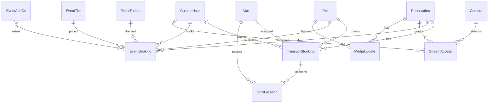

# Design Document: VIPet Premium Services

## Overview

This design covers the Premium Services feature for the VIPet luxury pet hotel platform. Premium Services adds four high-value service verticals to the existing reservation system:

1. **Transport** — Luxury van pickup/delivery with real-time GPS tracking
2. **Events** — Birthday and anniversary parties with customizable themes and tiers
3. **Live Streaming** — IP camera feeds with token-authenticated HLS playback
4. **Media Updates** — Daily staff-uploaded photos/videos with client gallery access

All premium services are linked to active Reservations and integrate with the existing Cart, Payment (Stripe), Notification, and Reservation systems. The design follows established Django/DRF patterns: `BigAutoField` primary keys, `ModelSerializer`-based APIs, JWT authentication via `rest_framework_simplejwt`, role-based permissions (`IsClient`, `IsAdmin`, `IsOwner`), and the existing `Notification` model for client alerts.

### Key Design Decisions

1. **Single app (`apps/premium`)** — All premium service models, serializers, views, and services live in one app to co-locate the domain and reduce cross-app coupling.
2. **Service layer pattern** — Business logic (state transitions, validation, pricing) lives in `services/` modules, keeping views thin and logic testable in isolation.
3. **State machine via model methods** — Transport and Event bookings use `ALLOWED_TRANSITIONS` dictionaries and `transition_to()` methods, matching the existing `Reservation` pattern.
4. **Celery for background tasks** — GPS polling, thumbnail generation, and token expiry notifications use Celery tasks with Redis as the broker.
5. **Cart integration via ContentType** — Premium bookings link to `CartItem` using Django's contenttypes framework for polymorphic references.
6. **Token-based stream access** — Camera streaming uses cryptographic tokens (2-hour TTL) with automatic revocation on renewal.

## Architecture



### App Structure

```
apps/premium/
├── __init__.py
├── apps.py
├── admin.py
├── models/
│   ├── __init__.py          # Re-exports all models
│   ├── transport.py         # Van, TransportBooking, GPSLocation
│   ├── events.py            # EventTheme, EventTier, EventAddOn, EventBooking
│   ├── streaming.py         # Camera, StreamAccess
│   └── media.py             # MediaUpdate
├── serializers/
│   ├── __init__.py
│   ├── transport.py
│   ├── events.py
│   ├── streaming.py
│   └── media.py
├── api_views/
│   ├── __init__.py
│   ├── transport.py
│   ├── events.py
│   ├── streaming.py
│   └── media.py
├── services/
│   ├── __init__.py
│   ├── transport.py
│   ├── events.py
│   ├── streaming.py
│   └── media.py
├── tasks.py                 # Celery tasks
├── permissions.py           # Premium-specific permissions
├── validators.py            # Shared validation utilities
├── urls.py
├── migrations/
└── tests/
    ├── __init__.py
    ├── conftest.py
    ├── factories.py
    ├── test_properties.py
    ├── test_transport.py
    ├── test_events.py
    ├── test_streaming.py
    ├── test_media.py
    └── test_integration.py
```

## Components and Interfaces

### API Endpoints

All endpoints are prefixed with `/api/v1/premium/` and require JWT authentication.

#### Transport Endpoints

| Method | Path | Permission | Description |
|--------|------|-----------|-------------|
| POST | `/transport/bookings/` | IsClient | Create transport booking |
| GET | `/transport/bookings/` | IsClient | List client's transport bookings |
| GET | `/transport/bookings/{id}/` | IsClient+Owner | Retrieve booking detail |
| POST | `/transport/bookings/{id}/cancel/` | IsClient+Owner | Cancel booking |
| POST | `/transport/bookings/{id}/advance/` | IsAdmin | Advance booking status |
| POST | `/transport/bookings/{id}/assign-van/` | IsAdmin | Assign van + driver |
| GET | `/transport/bookings/{id}/location/` | IsClient+Owner | Current GPS location |
| GET | `/transport/bookings/{id}/route/` | IsClient+Owner | Route history |
| GET | `/transport/vans/` | IsAdmin | List all vans |
| POST | `/transport/vans/` | IsAdmin | Create van |
| PATCH | `/transport/vans/{id}/` | IsAdmin | Update van |
| POST | `/transport/vans/{id}/deactivate/` | IsAdmin | Deactivate van |

#### Event Endpoints

| Method | Path | Permission | Description |
|--------|------|-----------|-------------|
| POST | `/events/bookings/` | IsClient | Create event booking |
| GET | `/events/bookings/` | IsClient | List client's event bookings |
| GET | `/events/bookings/{id}/` | IsClient+Owner | Retrieve event booking |
| POST | `/events/bookings/{id}/cancel/` | IsClient+Owner | Cancel event |
| POST | `/events/bookings/{id}/confirm/` | IsAdmin | Confirm event |
| POST | `/events/bookings/{id}/complete/` | IsAdmin | Complete event |
| GET | `/events/themes/` | Authenticated | List available themes |
| POST | `/events/themes/` | IsAdmin | Create theme |
| PATCH | `/events/themes/{id}/` | IsAdmin | Update theme |
| GET | `/events/tiers/` | Authenticated | List tiers |
| POST | `/events/tiers/` | IsAdmin | Create/update tier |
| GET | `/events/add-ons/` | Authenticated | List add-ons |
| POST | `/events/add-ons/` | IsAdmin | Create add-on |
| PATCH | `/events/add-ons/{id}/` | IsAdmin | Update add-on |

#### Streaming Endpoints

| Method | Path | Permission | Description |
|--------|------|-----------|-------------|
| POST | `/streaming/access/` | IsClient | Generate stream access token |
| GET | `/streaming/access/` | IsClient | List client's active accesses |
| GET | `/streaming/cameras/` | IsAdmin | List all cameras |
| POST | `/streaming/cameras/` | IsAdmin | Create camera |
| PATCH | `/streaming/cameras/{id}/` | IsAdmin | Update camera |
| POST | `/streaming/cameras/{id}/deactivate/` | IsAdmin | Deactivate camera |

#### Media Endpoints

| Method | Path | Permission | Description |
|--------|------|-----------|-------------|
| POST | `/media/updates/` | IsAdmin | Upload media update |
| GET | `/media/updates/?reservation={id}` | IsClient+Owner | List media for reservation |
| GET | `/media/updates/{id}/` | IsClient+Owner | Retrieve media detail |

### Service Layer

```python
class TransportService:
    @staticmethod
    def create_booking(client, reservation, pet, direction, address, scheduled_at) -> TransportBooking:
        """Validate inputs, create booking with status 'scheduled', send notification."""

    @staticmethod
    def advance_status(booking, staff_user) -> TransportBooking:
        """Advance to next valid status. Triggers GPS polling start/stop."""

    @staticmethod
    def cancel_booking(booking, requested_by) -> TransportBooking:
        """Cancel from eligible states (scheduled, en_route_pickup). Send notification."""

    @staticmethod
    def assign_van(booking, van, driver_name) -> TransportBooking:
        """Validate van is active and not conflicting, assign to booking."""

    @staticmethod
    def get_current_location(booking) -> GPSLocation | None:
        """Return most recent GPS location for active transport."""

    @staticmethod
    def get_route_history(booking) -> QuerySet[GPSLocation]:
        """Return all GPS locations ordered by recorded_at ascending."""


class EventService:
    @staticmethod
    def create_booking(client, reservation, pet, theme, tier, event_date, event_time, add_ons) -> EventBooking:
        """Validate inputs, calculate total price, create booking, send notification."""

    @staticmethod
    def calculate_total_price(tier: EventTier, add_ons: list[EventAddOn]) -> Decimal:
        """Return tier.base_price + sum(add_on.price), rounded to 2 decimal places."""

    @staticmethod
    def confirm_booking(booking, staff_user) -> EventBooking:
        """Transition pending -> confirmed, send notification."""

    @staticmethod
    def complete_booking(booking, staff_user) -> EventBooking:
        """Transition confirmed -> completed, send notification."""

    @staticmethod
    def cancel_booking(booking, user) -> EventBooking:
        """Cancel from eligible state with role validation."""


class StreamService:
    @staticmethod
    def generate_access(client, reservation, camera) -> StreamAccess:
        """Validate mapping, revoke previous access, generate token with 2hr TTL."""

    @staticmethod
    def revoke_camera_accesses(camera) -> int:
        """Revoke all active accesses for a camera. Returns count revoked."""


class MediaService:
    @staticmethod
    def upload_media(staff_user, reservation, pet, media_type, file, caption) -> MediaUpdate:
        """Validate file, create record, queue thumbnail task, send notification."""

    @staticmethod
    def validate_file(media_type: str, file) -> list[str]:
        """Return list of validation errors (empty = valid)."""
```

### Celery Tasks

```python
@shared_task(bind=True, max_retries=0)
def poll_gps_location(self, transport_booking_id: int):
    """Poll GPS API, store location record. Re-schedules if booking still active."""

@shared_task(bind=True, max_retries=3)
def generate_thumbnail(self, media_update_id: int):
    """Generate thumbnail for photo/video. Retries with exponential backoff."""

@shared_task
def check_stream_expiry():
    """Periodic (every 5 min): notify clients with tokens expiring within 10 min."""
```

## Data Models

### Transport Models

```python
class Van(models.Model):
    """VIPet transport van with GPS device."""
    id = models.BigAutoField(primary_key=True)
    registration_plate = models.CharField(max_length=20, unique=True)
    name = models.CharField(max_length=50)
    capacity = models.PositiveIntegerField()  # minimum 1
    gps_device_id = models.CharField(max_length=100, unique=True)
    is_active = models.BooleanField(default=True, db_index=True)
    image = models.ImageField(upload_to="vans/", null=True, blank=True)
    created_at = models.DateTimeField(auto_now_add=True)
    updated_at = models.DateTimeField(auto_now=True)

    class Meta:
        verbose_name = "Van"
        verbose_name_plural = "Vans"
        indexes = [
            models.Index(fields=["is_active", "-created_at"], name="van_active_idx"),
        ]


class TransportBooking(models.Model):
    """A scheduled van transport linked to a reservation."""
    DIRECTION_CHOICES = [
        ("pickup", "Pickup"),
        ("delivery", "Delivery"),
        ("both", "Both"),
    ]
    STATUS_CHOICES = [
        ("scheduled", "Scheduled"),
        ("en_route_pickup", "En Route Pickup"),
        ("pet_collected", "Pet Collected"),
        ("en_route_delivery", "En Route Delivery"),
        ("completed", "Completed"),
        ("cancelled", "Cancelled"),
    ]
    ALLOWED_TRANSITIONS = {
        "scheduled": ["en_route_pickup", "cancelled"],
        "en_route_pickup": ["pet_collected", "cancelled"],
        "pet_collected": ["en_route_delivery"],
        "en_route_delivery": ["completed"],
        "completed": [],
        "cancelled": [],
    }

    id = models.BigAutoField(primary_key=True)
    reservation = models.ForeignKey(
        "reservations.Reservation", on_delete=models.CASCADE,
        related_name="transport_bookings"
    )
    pet = models.ForeignKey("pets.Pet", on_delete=models.CASCADE, related_name="transport_bookings")
    client = models.ForeignKey(
        settings.AUTH_USER_MODEL, on_delete=models.CASCADE,
        related_name="transport_bookings"
    )
    van = models.ForeignKey(Van, on_delete=models.SET_NULL, null=True, blank=True, related_name="bookings")
    driver_name = models.CharField(max_length=100, blank=True)
    direction = models.CharField(max_length=10, choices=DIRECTION_CHOICES)
    pickup_address = models.CharField(max_length=500)
    scheduled_at = models.DateTimeField()
    status = models.CharField(max_length=20, choices=STATUS_CHOICES, default="scheduled", db_index=True)
    created_at = models.DateTimeField(auto_now_add=True)
    updated_at = models.DateTimeField(auto_now=True)

    class Meta:
        ordering = ["-created_at"]
        indexes = [
            models.Index(fields=["client", "-created_at"], name="transport_client_idx"),
            models.Index(fields=["status", "-scheduled_at"], name="transport_status_idx"),
            models.Index(fields=["van", "status"], name="transport_van_status_idx"),
        ]

    def can_transition_to(self, new_status: str) -> bool:
        return new_status in self.ALLOWED_TRANSITIONS.get(self.status, [])

    def transition_to(self, new_status: str) -> None:
        if not self.can_transition_to(new_status):
            raise ValueError(
                f"Cannot transition from '{self.status}' to '{new_status}'. "
                f"Allowed: {self.ALLOWED_TRANSITIONS.get(self.status, [])}"
            )
        self.status = new_status
        self.save()


class GPSLocation(models.Model):
    """A recorded GPS position for a van during active transport."""
    id = models.BigAutoField(primary_key=True)
    transport_booking = models.ForeignKey(
        TransportBooking, on_delete=models.CASCADE, related_name="gps_locations"
    )
    van = models.ForeignKey(Van, on_delete=models.CASCADE, related_name="gps_locations")
    latitude = models.DecimalField(max_digits=9, decimal_places=6)   # -90 to 90
    longitude = models.DecimalField(max_digits=10, decimal_places=6) # -180 to 180
    speed = models.DecimalField(max_digits=6, decimal_places=2, null=True, blank=True)
    heading = models.DecimalField(max_digits=5, decimal_places=2, null=True, blank=True)
    recorded_at = models.DateTimeField()
    created_at = models.DateTimeField(auto_now_add=True)

    class Meta:
        ordering = ["recorded_at"]
        indexes = [
            models.Index(fields=["transport_booking", "recorded_at"], name="gps_booking_time_idx"),
        ]
```

### Event Models

```python
class EventTheme(models.Model):
    """A named party theme available for event bookings."""
    id = models.BigAutoField(primary_key=True)
    name = models.CharField(max_length=100)
    description = models.TextField(max_length=500, blank=True)
    image = models.ImageField(upload_to="event_themes/", null=True, blank=True)
    is_available = models.BooleanField(default=True, db_index=True)
    created_at = models.DateTimeField(auto_now_add=True)
    updated_at = models.DateTimeField(auto_now=True)

    class Meta:
        ordering = ["name"]


class EventTier(models.Model):
    """A tier/package level with base price and inclusions."""
    TIER_CHOICES = [
        ("basic", "Basic"),
        ("premium", "Premium"),
        ("vip", "VIP"),
    ]

    id = models.BigAutoField(primary_key=True)
    name = models.CharField(max_length=10, choices=TIER_CHOICES, unique=True)
    description = models.TextField(max_length=500, blank=True)
    base_price = models.DecimalField(max_digits=7, decimal_places=2)  # max 99,999.99 MAD
    includes_cake = models.BooleanField(default=False)
    includes_decorations = models.BooleanField(default=False)
    includes_photo_package = models.BooleanField(default=False)
    includes_video_package = models.BooleanField(default=False)
    max_pet_guests = models.PositiveIntegerField(default=1)
    created_at = models.DateTimeField(auto_now_add=True)
    updated_at = models.DateTimeField(auto_now=True)

    class Meta:
        ordering = ["base_price"]


class EventAddOn(models.Model):
    """An optional extra purchasable alongside an event booking."""
    TYPE_CHOICES = [
        ("cake", "Custom Cake"),
        ("decorations", "Extra Decorations"),
        ("photo", "Photo Package"),
        ("video", "Video Package"),
        ("extra_guest", "Extra Pet Guest"),
    ]

    id = models.BigAutoField(primary_key=True)
    type = models.CharField(max_length=20, choices=TYPE_CHOICES)
    description = models.CharField(max_length=200, blank=True)
    price = models.DecimalField(max_digits=6, decimal_places=2)  # max 9,999.99 MAD
    is_available = models.BooleanField(default=True)
    created_at = models.DateTimeField(auto_now_add=True)
    updated_at = models.DateTimeField(auto_now=True)

    class Meta:
        ordering = ["type", "price"]


class EventBooking(models.Model):
    """A birthday/anniversary party booking for a pet."""
    STATUS_CHOICES = [
        ("pending", "Pending"),
        ("confirmed", "Confirmed"),
        ("completed", "Completed"),
        ("cancelled", "Cancelled"),
    ]
    ALLOWED_TRANSITIONS = {
        "pending": ["confirmed", "cancelled"],
        "confirmed": ["completed", "cancelled"],
        "completed": [],
        "cancelled": [],
    }

    id = models.BigAutoField(primary_key=True)
    reservation = models.ForeignKey(
        "reservations.Reservation", on_delete=models.CASCADE,
        related_name="event_bookings"
    )
    pet = models.ForeignKey("pets.Pet", on_delete=models.CASCADE, related_name="event_bookings")
    client = models.ForeignKey(
        settings.AUTH_USER_MODEL, on_delete=models.CASCADE,
        related_name="event_bookings"
    )
    theme = models.ForeignKey(EventTheme, on_delete=models.PROTECT, related_name="bookings")
    tier = models.ForeignKey(EventTier, on_delete=models.PROTECT, related_name="bookings")
    add_ons = models.ManyToManyField(EventAddOn, blank=True, related_name="bookings")
    event_date = models.DateField()
    event_time = models.TimeField()
    total_price = models.DecimalField(max_digits=8, decimal_places=2)
    status = models.CharField(max_length=12, choices=STATUS_CHOICES, default="pending", db_index=True)
    created_at = models.DateTimeField(auto_now_add=True)
    updated_at = models.DateTimeField(auto_now=True)

    class Meta:
        ordering = ["-created_at"]
        indexes = [
            models.Index(fields=["client", "-created_at"], name="event_client_idx"),
            models.Index(fields=["status", "-event_date"], name="event_status_idx"),
        ]
        constraints = [
            models.UniqueConstraint(
                fields=["pet", "event_date"],
                condition=models.Q(status__in=["pending", "confirmed"]),
                name="unique_pet_event_per_day",
            ),
        ]

    def can_transition_to(self, new_status: str) -> bool:
        return new_status in self.ALLOWED_TRANSITIONS.get(self.status, [])

    def transition_to(self, new_status: str) -> None:
        if not self.can_transition_to(new_status):
            raise ValueError(
                f"Cannot transition from '{self.status}' to '{new_status}'. "
                f"Allowed: {self.ALLOWED_TRANSITIONS.get(self.status, [])}"
            )
        self.status = new_status
        self.save()
```

### Streaming Models

```python
class Camera(models.Model):
    """An IP camera installed at a VIPet location."""
    LOCATION_TYPE_CHOICES = [
        ("suite", "Suite"),
        ("play_area", "Play Area"),
        ("pool", "Pool"),
        ("garden", "Garden"),
    ]

    id = models.BigAutoField(primary_key=True)
    name = models.CharField(max_length=100)
    location_type = models.CharField(max_length=20, choices=LOCATION_TYPE_CHOICES)
    location_identifier = models.CharField(max_length=50)
    rtsp_url = models.CharField(max_length=500)
    hls_url = models.CharField(max_length=500, blank=True)
    is_active = models.BooleanField(default=True, db_index=True)
    created_at = models.DateTimeField(auto_now_add=True)
    updated_at = models.DateTimeField(auto_now=True)

    class Meta:
        constraints = [
            models.UniqueConstraint(
                fields=["location_type", "location_identifier"],
                name="unique_camera_location",
            ),
        ]
        indexes = [
            models.Index(
                fields=["location_type", "location_identifier"],
                name="camera_location_idx",
            ),
        ]


class StreamAccess(models.Model):
    """A time-limited access grant for a client to view a camera feed."""
    id = models.BigAutoField(primary_key=True)
    reservation = models.ForeignKey(
        "reservations.Reservation", on_delete=models.CASCADE,
        related_name="stream_accesses"
    )
    camera = models.ForeignKey(Camera, on_delete=models.CASCADE, related_name="stream_accesses")
    client = models.ForeignKey(
        settings.AUTH_USER_MODEL, on_delete=models.CASCADE,
        related_name="stream_accesses"
    )
    access_token = models.CharField(max_length=128, unique=True, db_index=True)
    hls_stream_url = models.CharField(max_length=600)
    is_active = models.BooleanField(default=True, db_index=True)
    expires_at = models.DateTimeField()
    created_at = models.DateTimeField(auto_now_add=True)

    class Meta:
        indexes = [
            models.Index(
                fields=["reservation", "camera", "is_active"],
                name="stream_res_cam_active_idx",
            ),
            models.Index(fields=["expires_at", "is_active"], name="stream_expiry_idx"),
        ]
```

### Media Models

```python
class MediaUpdate(models.Model):
    """A photo or video uploaded by staff for a pet during their stay."""
    MEDIA_TYPE_CHOICES = [
        ("photo", "Photo"),
        ("video", "Video"),
    ]

    id = models.BigAutoField(primary_key=True)
    reservation = models.ForeignKey(
        "reservations.Reservation", on_delete=models.CASCADE,
        related_name="media_updates"
    )
    pet = models.ForeignKey("pets.Pet", on_delete=models.CASCADE, related_name="media_updates")
    uploaded_by = models.ForeignKey(
        settings.AUTH_USER_MODEL, on_delete=models.SET_NULL,
        null=True, related_name="uploaded_media"
    )
    media_type = models.CharField(max_length=10, choices=MEDIA_TYPE_CHOICES)
    file = models.FileField(upload_to="media_updates/%Y/%m/%d/")
    thumbnail = models.ImageField(upload_to="media_updates/thumbnails/", null=True, blank=True)
    caption = models.CharField(max_length=500, blank=True)
    file_size = models.PositiveIntegerField()  # bytes
    duration = models.PositiveIntegerField(null=True, blank=True)  # seconds, videos only
    created_at = models.DateTimeField(auto_now_add=True)

    class Meta:
        ordering = ["-created_at"]
        indexes = [
            models.Index(fields=["reservation", "-created_at"], name="media_res_created_idx"),
        ]
```

### Entity Relationship Diagram



### Integration Points

**Cart Integration**: Premium bookings link to `CartItem` via Django ContentTypes:
- `CartItem` gains `content_type` (FK to ContentType) and `object_id` (PositiveIntegerField) fields
- `GenericForeignKey` provides access to the linked `TransportBooking` or `EventBooking`
- Pricing engine applies loyalty + promo discounts; dynamic pricing skipped for non-boarding services

**Notification Integration**: All events use the existing `Notification` model:
```python
Notification.objects.create(user=client, message=formatted_message)
```

**Reservation Integration**: All premium services validate `reservation.status == "approved"` at the service layer before any creation.

## Correctness Properties

*A property is a characteristic or behavior that should hold true across all valid executions of a system — essentially, a formal statement about what the system should do. Properties serve as the bridge between human-readable specifications and machine-verifiable correctness guarantees.*

### Property 1: Reservation Approved Gate

*For any* premium service operation (transport booking creation, event booking creation, stream access generation, or media upload), the operation SHALL succeed only when the associated reservation has status "approved"; all other reservation statuses SHALL result in rejection.

**Validates: Requirements 1.5, 5.5, 8.2, 10.2**

### Property 2: Transport Status State Machine

*For any* transport booking in any current status and any attempted target status, the transition SHALL succeed if and only if the target is in ALLOWED_TRANSITIONS[current_status]. Additionally, only staff SHALL advance forward; clients may only cancel from "scheduled" or "en_route_pickup".

**Validates: Requirements 2.1, 2.2, 2.6, 2.7**

### Property 3: Event Status State Machine

*For any* event booking and any (user_role, current_status, target_status) combination, the transition SHALL succeed if and only if it is valid per ALLOWED_TRANSITIONS AND the user has the required role (staff for confirm/complete, client for cancel from pending only).

**Validates: Requirements 7.1, 7.5, 7.6**

### Property 4: Ownership Access Control

*For any* authenticated client attempting to access a premium service resource belonging to a different client, the system SHALL return a 403 response without revealing the resource existence.

**Validates: Requirements 1.8, 3.5, 8.7, 11.2, 14.1, 14.2, 14.4, 14.5, 14.8**

### Property 5: Pet-Reservation Linkage

*For any* operation requiring a pet and reservation (transport booking, media upload), the operation SHALL succeed only when the pet belongs to the authenticated client AND is the pet linked to the specified reservation.

**Validates: Requirements 1.4, 10.3**

### Property 6: Transport Datetime Validation

*For any* datetime provided for transport booking, the booking SHALL be accepted only if the datetime is strictly in the future AND falls within the reservation's [start_date, end_date] range.

**Validates: Requirements 1.3, 1.7**

### Property 7: Pickup Address Validation

*For any* string provided as a pickup address, the transport booking SHALL be accepted only if the string is non-empty after trimming whitespace AND has length ≤ 500 characters.

**Validates: Requirements 1.6**

### Property 8: GPS Coordinate Validation

*For any* GPS location record, latitude SHALL be within [-90, 90], longitude SHALL be within [-180, 180], and recorded_at SHALL not be in the future.

**Validates: Requirements 3.4**

### Property 9: GPS Current Location Returns Most Recent

*For any* transport booking with N GPS locations (N > 0), the current location query SHALL return the record with the maximum recorded_at timestamp.

**Validates: Requirements 3.2**

### Property 10: GPS Route History Ordering

*For any* transport booking with GPS locations, the route history SHALL return records ordered by recorded_at ascending (each consecutive pair satisfies r[i].recorded_at ≤ r[i+1].recorded_at).

**Validates: Requirements 3.3**

### Property 11: Van Uniqueness Constraints

*For any* van creation where registration_plate OR gps_device_id matches an existing van, the creation SHALL be rejected with an error identifying the duplicate field.

**Validates: Requirements 4.5**

### Property 12: Van Assignment Conflict Detection

*For any* van assignment attempt, the assignment SHALL succeed only if the van has is_active=True AND no other booking for the same van is in an active transport status (en_route_pickup, pet_collected, en_route_delivery) at a conflicting time.

**Validates: Requirements 4.3**

### Property 13: Event Price Calculation

*For any* event tier with base_price P and any set of add-ons with prices [p1, p2, ..., pN], the event booking total_price SHALL equal exactly P + sum(p1..pN), rounded to 2 decimal places.

**Validates: Requirements 5.1, 5.7**

### Property 14: Event Date Within Reservation Range

*For any* event date D and associated reservation with [start_date, end_date], the event booking SHALL be accepted only if start_date ≤ D ≤ end_date.

**Validates: Requirements 5.2**

### Property 15: Event Time Within Operating Hours

*For any* event time T, the event booking SHALL be accepted only if 08:00 ≤ T ≤ 20:00.

**Validates: Requirements 5.3**

### Property 16: No Duplicate Events Per Pet Per Date

*For any* pet and date, there SHALL be at most one event booking with status in ("pending", "confirmed") for that (pet, date) combination.

**Validates: Requirements 5.4**

### Property 17: Unavailable Themes Excluded from Client List

*For any* set of event themes with mixed is_available values, the client-facing list SHALL contain only themes where is_available=True, while existing bookings referencing unavailable themes remain intact.

**Validates: Requirements 6.5**

### Property 18: Stream Token Uniqueness and Expiration

*For any* stream access generation, the access_token SHALL be unique across all records, and expires_at SHALL equal created_at + 2 hours.

**Validates: Requirements 8.1**

### Property 19: Camera-Location Matching

*For any* stream access request, access SHALL be granted only if the camera's (location_type, location_identifier) matches the location assigned to the client's reservation.

**Validates: Requirements 8.3**

### Property 20: At Most One Active Stream Per (Reservation, Camera)

*For any* (reservation, camera) pair, after generating a new stream access, there SHALL be exactly one StreamAccess record with is_active=True for that pair.

**Validates: Requirements 8.5**

## Error Handling

### Validation Errors (400)

All validation errors use DRF's standard format:
```json
{
  "field_name": ["Error message."],
  "non_field_errors": ["Cross-field error."]
}
```

### State Machine Errors (400)

Invalid transitions return a descriptive message:
```json
{"detail": "Cannot transition from 'pet_collected' to 'cancelled'. Allowed: ['en_route_delivery']"}
```

### Access Control Errors

| Status | Scenario |
|--------|----------|
| 401 | Unauthenticated request |
| 403 | Client accessing another client's resource (no existence leakage) |
| 403 | Client attempting admin-only action |

### File Upload Errors (400)

| Violation | Message |
|-----------|---------|
| Photo wrong format | `"Format invalide. Formats acceptés : JPEG, PNG, WEBP."` |
| Photo too large | `"La taille du fichier ne doit pas dépasser 10 Mo."` |
| Video wrong format | `"Format invalide. Seul le format MP4 est accepté."` |
| Video too large | `"La taille du fichier ne doit pas dépasser 100 Mo."` |
| Video too long | `"La durée de la vidéo ne doit pas dépasser 60 secondes."` |

### External Service Failures

| Service | Handling |
|---------|----------|
| GPS Device API unreachable | Log error, skip cycle, retry next 10s interval. No client-facing error. |
| Media storage failure | Return 503 with retry suggestion |
| Celery task failure | Retry with exponential backoff (3 attempts), dead-letter on exhaustion |

## Testing Strategy

### Property-Based Testing (Hypothesis)

The project already uses Hypothesis (`.hypothesis/` directory with constants). All 20 correctness properties are implemented as Hypothesis property-based tests.

**Configuration:**
- Library: `hypothesis` (already installed)
- Minimum iterations: 100 per property (`@settings(max_examples=100)`)
- Test file: `apps/premium/tests/test_properties.py`
- Tag format: `# Feature: vipet-premium-services, Property N: <title>`

**Key generators (strategies):**
- `reservation_statuses()` — all valid reservation status values
- `transport_transitions()` — all (current_status, target_status) pairs
- `event_transitions()` — all (role, current_status, target_status) triples
- `valid_datetimes(reservation)` — datetimes within/outside reservation range
- `gps_coordinates()` — (lat, lon, timestamp) within and outside bounds
- `event_prices()` — random tier base_price + list of add-on prices
- `pickup_addresses()` — strings of varying length including edge cases
- `media_file_metadata()` — random (format, size, duration) combinations
- `stream_access_sequences()` — sequences for same (reservation, camera) pair

### Unit Tests (Example-Based)

Specific scenarios not suited for PBT:
- Direction "both" creates round-trip transport record
- Van assignment with specific van and driver
- Van deactivation preserves in-progress transports
- Event theme/tier/add-on CRUD operations
- Stream access response contains HLS URL and token
- Media detail returns full URL, size, duration
- Notification content includes expected details
- 401 for unauthenticated access
- 403 with no resource existence leakage
- Empty media list returns appropriate message

### Integration Tests

- Cart integration: premium item → cart → checkout → booking status update
- GPS polling task: mock API, verify location records stored
- Thumbnail generation: mock processor, verify async task queued
- Token expiry notification: create expiring tokens, run check, verify notifications
- Notification timing: verify creation within acceptable window of status changes

### Test Organization

```
apps/premium/tests/
├── conftest.py              # Fixtures: users, reservations, pets, vans, cameras
├── factories.py             # Model factories (factory_boy)
├── test_properties.py       # 20 Hypothesis property-based tests
├── test_transport.py        # Transport API + service unit tests
├── test_events.py           # Event API + service unit tests
├── test_streaming.py        # Streaming API + service unit tests
├── test_media.py            # Media API + service unit tests
└── test_integration.py      # Cart, notification, and task integration tests
```
